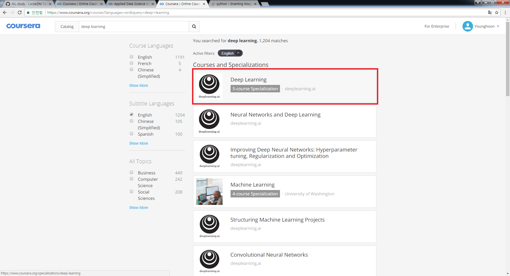
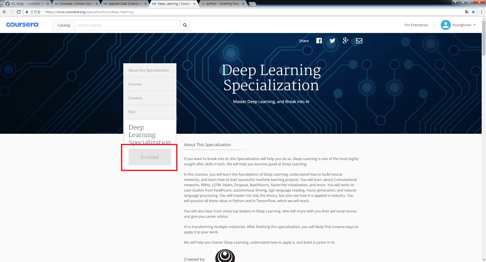
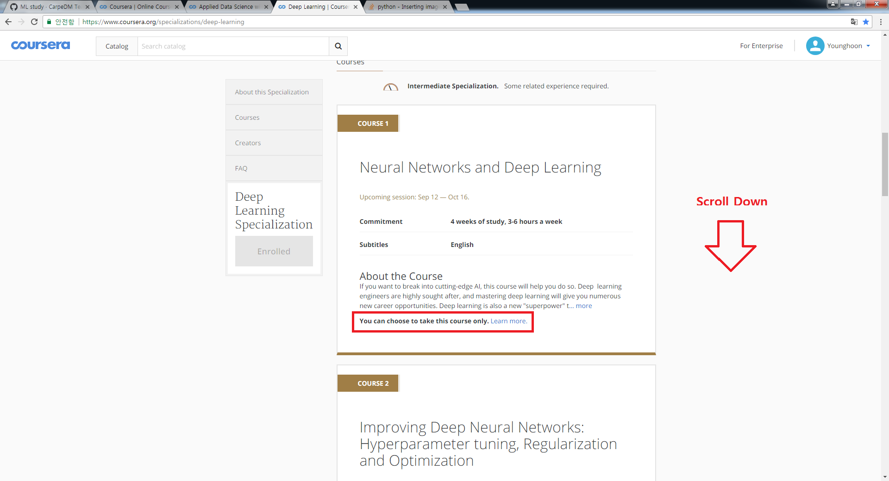
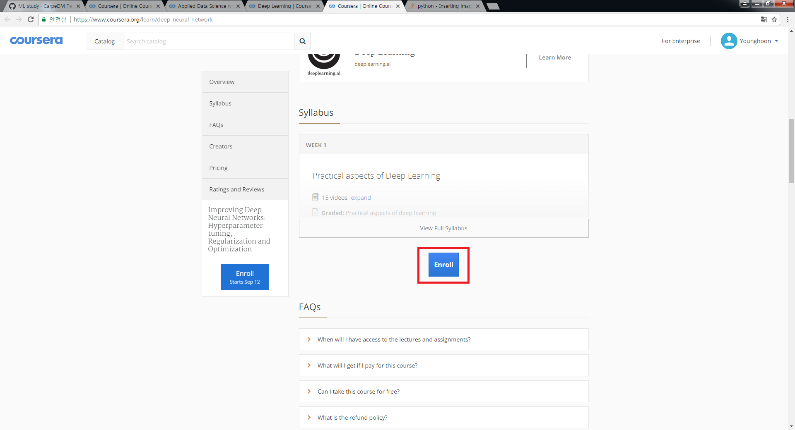

How to Enroll in Coursera
==========================

1. https://www.coursera.org/

   Coursera 홈페이지에 접속합니다. Catalog에 "deep learning"을 입력합시다.
   
     
   
     

2. Deep Learning Specialization을 클릭합니다.

     
   
     

3. 이 강의는 수강료를 지불하고 개인정보를 입력할 경우, 이수를 했다는 것을 증명해주는 Certificate를 받을 수 있습니다.

     
   위와 같은 이수증을 받고자 하시는 경우 매월 $49 USD를 지불하셔야 합니다. 예상 수강 기간은 총 3개월입니다.

     
   
     

   만일 이수증 없이 무료로 수강하시고자 하는 경우 아래와 같이, specialization을 통하지 않고 각 강의를 따로따로 수강 신청을 해주시면 됩니다.
   
     
   
     
     
   