## Session 01
#### 사전준비와 Python 기초문법

* GitHub 가입
* GitHub Desktop 설치
* Anaconda 설치
* Atom IDE 설치
* Python 기초문법 연습


1. GitHub에 본인 이름과 같은 이름의 폴더를 생성합니다.
2. README.md 파일을 생성해 업로드합니다.
3. 다음의 코드를 완성해 session01.py로 업로드합니다.
```python
num = input('Number of steps : ')
try: num = int(num)
except: print('Invalid input!')
for i in range(num):
    # 여기서부터 작성해주시면 됩니다
```  
코드는 각 입력값에 따라 다음의 출력값을 나타내어야 합니다.
<br></br><center>
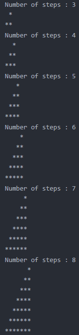

#### GitHub 가입

[GitHub 홈페이지](https://github.com)에 들어가서 가입합니다.
<br></br>
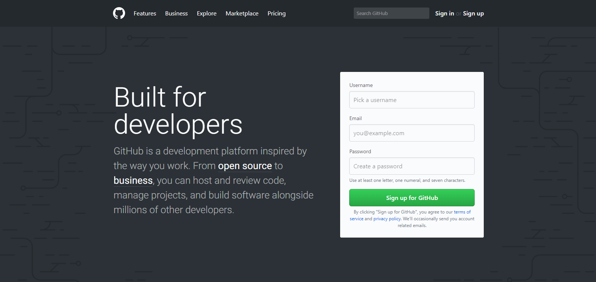
<br></br>
가입하신 뒤 GitHub 아이디 또는 메일주소를 공유해주세요.
GitHub와 연결된 메일주소로 보내드린 [CarpeDM 저장소](https://github.com/CarpeDM2017/StudyML)에 들어오시면 앞으로 진행할 스터디 자료를 함께 보실 수 있습니다.
<br></br>
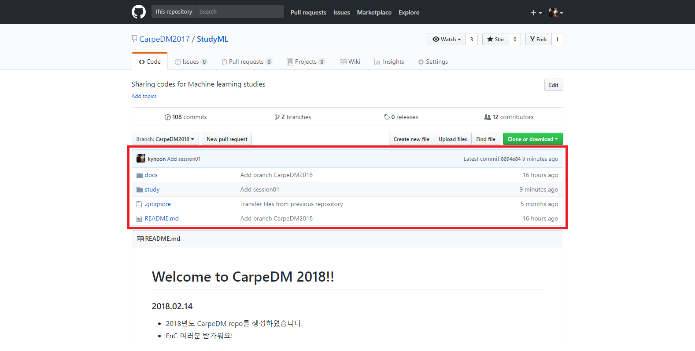
<br></br>

#### GitHub Desktop 설치

[GitHub Desktop](https://desktop.github.com/)은 GitHub의 여러 기능들을 편리하게 이용할 수 있도록 해주는 프로그램입니다. GitHub Desktop을 설치하고, 앞서 가입한 아이디로 로그인하고나면 아래와 같이 어느 저장소에서 작업할 것인지를 선택하는 창이 나옵니다. 우리는 이미 GitHub에 등록된 CarpeDM 저장소에서 작업할 예정이므로, "Clone a repository"를 클릭해주시면 됩니다.
<br></br>
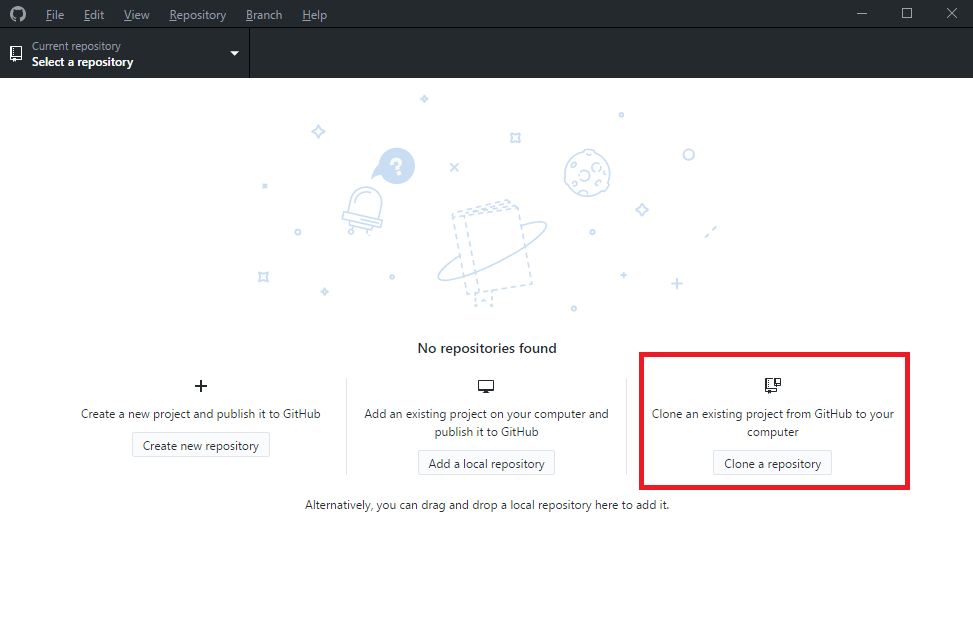
<br></br>
"CarpeDM2017"의 하위 저장소인 "StudyML"을 선택해주세요. 아래 Local path는 향후 GitHub의 저장소와 동기화할 우리 컴퓨터 내부의 주소입니다. Local path로 설정한 폴더에서 파일을 추가하거나, 삭제하거나, 변경하는 경우 GitHub 저장소에서도 동일한 작업을 수행하게 됩니다.
<br></br>
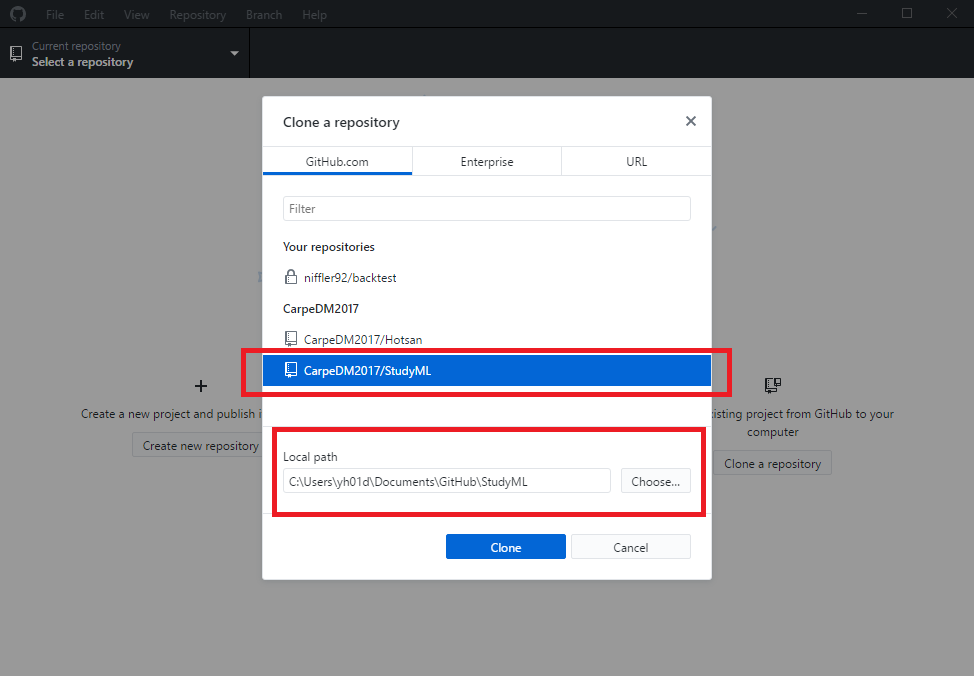
<br></br>

#### Anaconda 설치

[Anaconda](https://www.anaconda.com/download/)는 Python 언어와 더불어 데이터 과학 분야에서 자주 사용하는 라이브러리들을 함께 설치해주고, 관리해주는 도구입니다. 아래 그림과 같이 Python 3.x version을 설치해주세요.
<br></br>
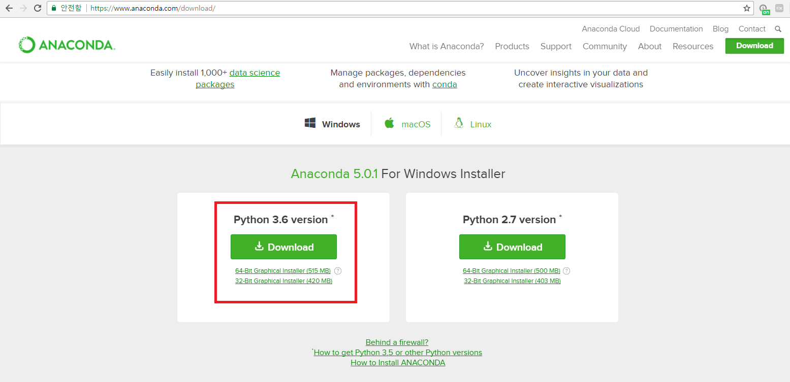
<br></br>
설치가 끝나고 나면 각 운영체제에 맞는 명령 프롬프트를 이용해 Python이 제대로 설치되었는지 확인해봅시다. Windows라면 명령 프롬프트(command line prompt), OS X라면 터미널(terminal), Linux라면 배시 쉘(BASH)에서 "python" 명령어를 실행해봅시다.
<br></br>
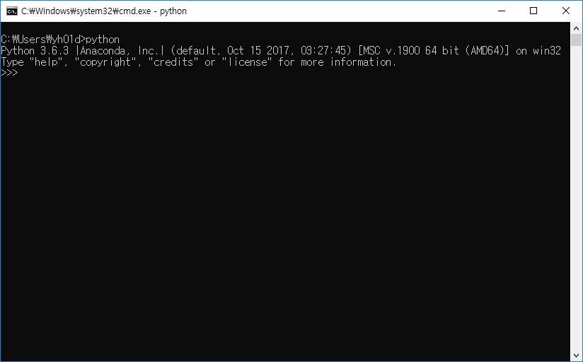
<br></br>
올바르게 설치되었다면, "python" 명령어를 실행하였을 때 위 그림과 같이 "Python 3.x.x" 버전과 그 옆에 "Anaconda, Inc."라는 글씨가 출력되어야 합니다.

#### Atom IDE 설치

마지막으로 [Atom](https://atom.io/)을 설치해 본격적으로 Python 공부를 시작해봅시다. Atom은 다양한 운영체제에서 이용할 수 있고, 다양한 프로그래밍 언어를 지원하며, 이용자에 따라 쉽게 구성요소를 변경할 수 있는 텍스트 편집기입니다. 설치가 끝나면 GitHub Desktop에서 CarpeDM 저장소를 Atom으로 열어봅시다.
<br></br>
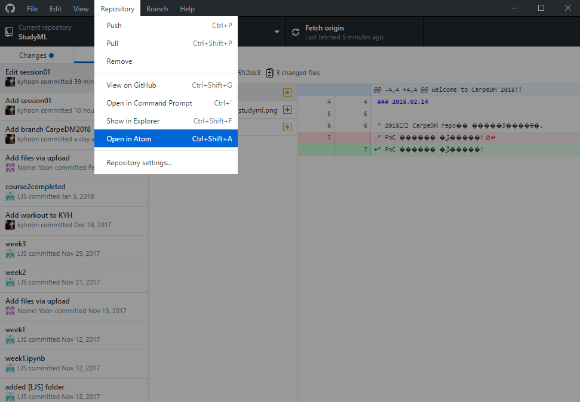
<br></br>
GitHub에 있는 저장소에 들어갈 때 나오는 공지글은 가장 상위 폴더에 있는 README.md고, 현재 이 문서는 study 폴더 안에 있는 session01.md입니다. Atom으로 한번 확인해봅시다.

지금부터 작성할 Python 파일을 저장하기 위해 study 폴더 아래에 자신의 이름과 같은 이름을 가지는 폴더를 생성해봅시다. 그 폴더 안에 가장 상위 폴더에 있는 README.md를 복사해, 제목을 제외하고 전부 지운 뒤 아래와 같은 형태로 만들어봅시다. 예시를 위해 적은 것이니 (이하 여백) 부분은 여백으로 둬주시면 되겠습니다.
<br></br>
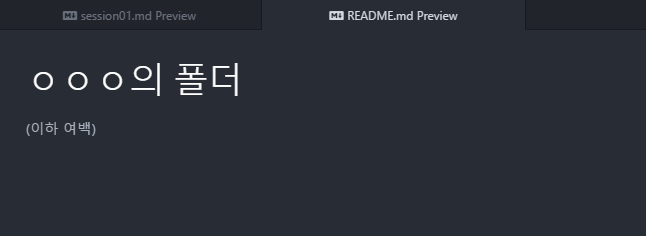
<br></br>
방금 생성한 폴더를 GitHub 저장소 내에서도 생성하기 위해서는 작업한 내용을 GitHub Desktop을 이용해 저장소로 전송해주어야 합니다. 이를 위해서는 우선 첫째, 저장소의 위치와 브랜치를 확인해야 합니다. 현재 우리가 이용하고 있는 저장소는 "StudyML", 브랜치는 "CarpeDM2018"입니다. 둘째로는 수정한 내용을 전송하기 전, 저장소의 내용을 최신 버전으로 갱신해두어야 합니다. 상단 맨 오른쪽의 "Fetch origin"을 눌러 저장소를 갱신합시다.
<br></br>
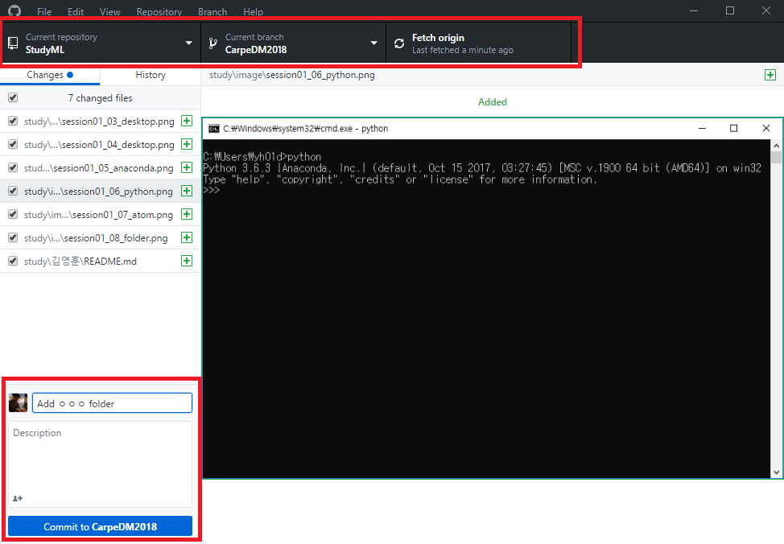
<br></br>
셋째로 왼쪽 하단에 자신이 작업한 내용에 대한 간략한 제목과 설명을 적은 뒤, "commit to CarpeDM2018"을 눌러 이를 등록합시다. 마지막으로 "Push origin"을 눌러 전송하면 됩니다.
<br></br>
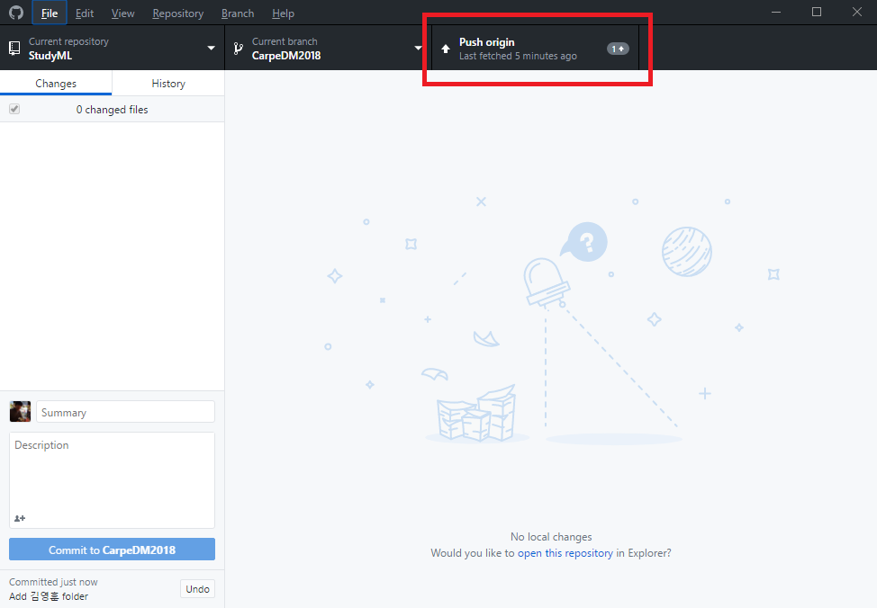
<br></br>

#### Python 기초문법 연습

* ##### 자료형과 변수
<b>자료형</b>이란 프로그래밍의 핵심 단위로, Python에서 주로 이용하는 자료형은 다음과 같습니다.

| 자료형 | 설명 |
| --- | --- |
| <b>논리(bool)</b> | 참(1) 또는 거짓(0) |
| <b>숫자(int, float)</b> | 정수 또는 실수 |
| <b>문자열(str)</b> | 단어, 문자들의 집합 |
| <b>리스트(list)</b> | [list1, list2, list3, list4] |
| <b>튜플(tuple)</b> | (tuple1, tuple2, tuple3) |
| <b>딕셔너리(dict)</b> | {key1 : value1, key2 : value2} |
| <b>집합(set)</b> | {set1, set2, set3, set4} |
| <b>없음(None)</b> | 그 어떤 자료형도 아닌 경우 |


<b>변수</b>란 위와 같은 자료형의 값을 저장하는 공간입니다. 변수에 저장되는 값은 대입 연산자(=)를 통해 정할 수 있습니다.

```python
a = True
b = 3.14
print(a + b)  # 4.14

c = a + b
print(c)  # 4.14
print(c is a + b)   # True

b = 0
print(a + b)  # 1
print(c)  # 4.14
print(c is a + b)   # False
```

위 코드에서 True와 3.14는 각각 논리, 숫자 자료형이고 a와 b는 이 값을 저장해, 이후의 연산에 활용할 수 있도록 해주는 변수입니다. c 또한 숫자 자료형을 저장한 변수가 됩니다.

* ##### 조건문과 반복문
    우리가 작성한 코드는 일반적으로 위에서부터 차례대로 작동합니다. 앞선 코드에서 변수 b의 값은 실행할 때마다 언제나 3.14에서 0으로 변화하고, 그 반대방향으로는 변화하지 않습니다. 그러나 <b>조건문</b>과 <b>반복문</b> 등의 제어문을 사용하면 코드의 진행순서를 변경할 수 있습니다.

    <b>조건문</b>이란 정해진 조건을 만족할 때에만 수행하는 구문입니다. 그리고 <b>반복문</b>이란 <b>조건문</b>과 결합하여, 정해진 조건을 만족하면 지정한 부분으로 다시 돌아가 같은 내용을 수행하는 구문을 뜻합니다.
    ```python
    ans = None
    # 여기서부터 반복문
    while(ans == None):
        ans = input('치킨을 주문하시겠습니까? ')
        if (ans == '예'):          # 조건문
            print('반반무많이')
        else:                     # 조건에 해당되지 않는 경우
            ans = None
            print('예 또는 아니오로 대답해주세요.')  
    # 여기까지 반복문
    print('치멘')
    ```
    위 코드에서 while문은 ans 변수에 None이 아닌 값이 저장될 때까지 들여쓰기한 부분을 계속 반복하게 합니다. 이때 if문이 ans에 입력된 값이 '예'인지를 확인하고, '예'일 경우 if 아래 들여쓰기한 부분, 아닐 경우엔 else 아래 들여쓰기한 부분을 수행하도록 제어하고 있습니다.
