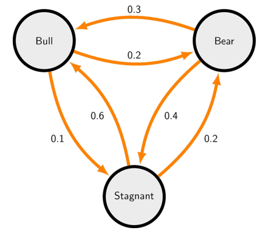
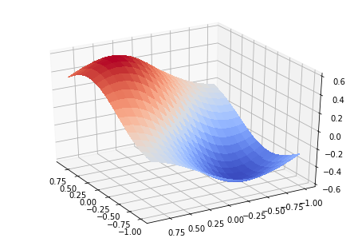

## Session 02
### 함수와 클래스

* Python 기초문법 연습
* Python의 내장함수
* 함수와 클래스
* Numpy 패키지
* Matplotlib 패키지


1. 다음의 문제에 대한 답을 구해봅시다. 그 풀이과정을 session02.py로 업로드해주세요.
<br></br>

<br></br>
어떤 나라의 시장(market)은 매월 상승장(Bull market), 하락장(Bear market), 또는 횡보장(Stagnant market) 중 한 가지 상태를 가진다고 합니다. 이때 현재의 시장이 특정 상태에 있을 때, 한 달 뒤 이 시장이 가질 상태에 대한 확률이 위 그림에 나타나 있습니다. 예컨대, 현재 상승장에 있다면 다음 달에는 0.2의 확률로 하락장, 0.1의 확률로 횡보장으로 이동하고, 남은 0.7의 확률로 같은 상승장에 머무르게 됩니다.
<br></br>
만일 지금 시장이 횡보장이라면, 10년 뒤 시장은 세 가지 중 어떤 상태에 있을 확률이 가장 높을까요?

2. 같은 문제 상황에 대해 현재부터 1년 뒤까지 다시 횡보장에 들어서지 않을 확률을 구해보고 이를 그래프로 그려봅시다. 그래프의 가로축은 0부터 12, 세로축은 0개월부터 해당 가로축 개월수까지 횡보장에 들어서지 않을 확률입니다. 예를 들어 x가 3이면, y는 1개월, 2개월, 3개월차에 모두 횡보장이 아닐 확률입니다. 단 가로축이 0일 때 세로축의 값은 1로 정의합니다. 마찬가지로 session02.py에 코드를 적어주시면 됩니다.


### Python 기초문법 연습

| 자료형                  | 설명                           | 연산                     |
| ----------------------- | ------------------------------ | ------------------------ |
| <b>논리(bool)</b>       | 참(1) 또는 거짓(0)             | or(+), and(\*)           |
| <b>숫자(int, float)</b> | 정수 또는 실수                 | +, -, \*, /, %           |
| <b>문자열(str)</b>      | 단어, 문자들의 집합            | +, \*, [ ]               |
| <b>리스트(list)</b>     | [list1, list2, list3, list4]   | +, \*, [ ], del, append  |
| <b>튜플(tuple)</b>      | (tuple1, tuple2, tuple3)       | +, \*, [ ]               |
| <b>딕셔너리(dict)</b>   | {key1 : value1, key2 : value2} | [ ], keys(), values()    |
| <b>집합(set)</b>        | {set1, set2, set3, set4}       | intersection, union, add |
| <b>없음(None)</b>       | 그 어떤 자료형도 아닌 경우     |                          |

지난 스터디에 이어 배열 구조의 자료형을 다루어봅시다.
```Python
new_list = [True, 1, 'True']
new_tuple = (False, 0, 'False')
new_dict = {1 : False, 0 : True}

print(new_list[0] + new_tuple[1])   # True + 0 == 1
print(new_dict[0] + new_tuple[1])   # True + 0 == 1
print(new_list[2] + new_tuple[2])   # 'True' + 'False' == 'TrueFalse'
print(new_list[1] + new_dict[0])    # 1 + True == 2

new_list[0] = None  # new_list = [None, 1, 'True']
new_tuple[1] = None # TypeError
new_dict[1] = None  # new_dict = {0 : True, 1 : None}

new_set = set('FnC' + 'CarpeDM')    # {'C', 'D', 'F', 'M', 'a', 'e', 'n', 'p', 'r'}
```
배열은 다른 배열을 그 원소로 가질 수 있습니다.
```Python
list_2d = list()
for i in range(1,5):
    list_2d.append(list(range(i)))
print(list_2d)  # [[0], [0, 1], [0, 1, 2], [0, 1, 2, 3]]

list_2d[2][1] = -1
print(list_2d)  # [[0], [0, 1], [0, -1, 2], [0, 1, 2, 3]]
```

### Python의 내장함수

Python에서는 print, input, range, append와 같이 자료형을 보다 편리하게 다루기 위한 여러가지 함수를 자체적으로 제공합니다. 여기서 <b>함수</b>란 어떤 자료형을 입력값으로 주었을 때, 정해진 결과값을 돌려주는 관계를 의미합니다. 함수를 정의하는 문법을 살펴보기 전에, 자주 사용하는 내장함수들에는 어떤 것이 있는지 한번 살펴봅시다.
```Python
new_list = [True, 0, abs(-1), 2, 3]
new_list = sorted(new_list)     # new_list = [0, True, 1, 2, 3]
all(new_list)   # False
any(new_list)   # True
min(new_list)   # 0
max(new_list)   # 3
len(new_list)   # 5

for i, j in enumerate(new_list):    # 0 0
    print(i,j)                      # 1 True
                                    # 2 1
                                    # 3 2
                                    # 4 3

new_list[1] == new_list[2]          # True
id(new_list[1]) == id(new_list[2])  # False

3 == int('3')   # True
str(3) == '3'   # True
int('101', 2)   # 5
int('F34', 16)  # 3892

type(3) # int
isinstance(3, float)    # False
3 == float(3)   # True

list1 = list(range(3))
list2 = list(range(3,6))
list(zip(list1, list2)) # [(0, 3), (1, 4), (2, 5)]
```

### 함수와 클래스

* #### 함수
Python에서 내장함수로 제공하지 않는 특정한 기능을 여러번 반복해서 수행하고 싶을 때, 직접 함수를 정의해 이를 활용할 수 있습니다. Python에서의 함수는 def 명령어를 통해 정의합니다. 입력값이 될 변수를 괄호 안에 적고, 출력값을 def 구문 안에 있는 return 명령어 뒤에 적습니다.

```Python
def order(menu, number):
    # 입력값에 대한 예외처리용 구문
    assert isinstance(menu, str), "menu must be a string"
    assert isinstance(number, int), "number must be an integer"
    assert number > 0, "number must be positive"

    return "여기 {} {}인분이요!!".format(menu, number)

print(order("돼지갈비", 3))    # 여기 돼지갈비 3인분이요!!
print(order("파이썬", 20))    # 여기 파이썬 20인분이요!!
print(order(3, "돼지갈비"))     # AssertionError

type(order("파이썬", 20))  # str
```
이때 함수는 입력값이나 출력값을 가지지 않을 수 있습니다. 이때 출력값의 자료형은 None형입니다.
```Python
def order():
    print("주문하시겠어요?")

order()             # 주문하시겠어요?
print(order())      # 주문하시겠어요? / None
type(order())       # 주문하시겠어요? / NoneType
```

* #### 클래스

<br></br>
쿠키틀을 한번 만들어두면 같은 모양의 쿠키를 계속 만들어낼 수 있듯이, 동일한 형태의 변수와 함수를 계속해서 생성하기 위해 Python에서는 <b>클래스</b>라는 도구를 이용합니다. 클래스라는 쿠키틀로 찍어낸 쿠키를 <b>객체</b> 또는 <b>인스턴스</b>라고 부릅니다. 같은 클래스의 객체는 같은 구조를 가지고 있지만, 저장되어 있는 변수값은 서로 다를 수 있습니다.

```Python
class Chicken:
    def __init__(self, menu):

        self.menus = {'후라이드' : 15000, '양념' : 20000, '반반' : 18000}

        assert isinstance(menu, str), "menu must be a string"
        assert menu in self.menus.keys(), "해당 메뉴는 현재 서비스하고 있지 않습니다"

        self.menu = menu

    def order(self, number):
        assert isinstance(number, int), "number must be an integer"
        assert number > 0, "number must be positive"

        self.number = number
        print("여기 {} {}인분이요!!".format(self.menu, number))

    def calculate(self):
        total = self.menus[self.menu] * self.number
        print("{}원 되시겠습니다.".format(total))

chicken1 = Chicken("양념")
chicken1.order(3)                   # 여기 양념 3인분이요!!
chicken1.calculate()                # 60000원 되시겠습니다.
chicken1.menus["파닭"] = 25000
chicken1.menu = "파닭"
chicken1.calculate()                # 75000원 되시겠습니다.

chicken2 = Chicken("파닭")           # AssertionError
```
여기서 chicken1, chicken2는 Chicken 클래스의 객체들이고, 클래스의 정의에 따라 \__init\__, order, calculate 함수와 menus, menu, number 변수를 가지고 있습니다. 이때 order와 같이 클래스의 객체가 가지고 있는 함수를 <b>메소드</b>라고 부릅니다. \__init\__ 메소드와 같이 \__로 시작하는 메소드는 그 자체로 특수한 기능을 가지고 있는데요, 주로 객체의 생성, 복사, 출력 등과 관련한 작업을 자동으로 수행해줍니다.

### Numpy 패키지

Python 커뮤니티에는 Numpy, Matplotlib와 같이 여러 훌륭한 <b>패키지</b>가 있습니다. 이러한 패키지를 이용하면 Python을 사용하는 다른 개발자들이 작성한 클래스와 함수들을 내가 쓰는 코드에 불러와 바로 구현하는 일이 가능합니다. 패키지를 사용하기 위해서는 우선 해당 패키지를 압축파일 형태로 직접 다운로드하거나, pip와 같은 프로그램을 통해 설치해야합니다. 그런데 우리는 Python을 설치할 때에 Anaconda를 통해 여러 라이브러리를 함께 설치했으므로, 다음과 같은 구문을 통해 몇가지 패키지를 바로 이용할 수 있습니다.
```Python
import numpy                            # Numpy 패키지를 이용합니다
import numpy as np                      # Numpy를 np라는 이름으로 이용합니다
from numpy import linalg                # Numpy 안에 있는 linalg만을 이용합니다
from matplotlib import pyplot as plt    # Matplotlib 안에 있는 pyplot을 plt라는 이름으로 이용합니다
import matplotlib.pyplot as plt         # 위와 동일
```

Numpy는 다차원 벡터공간에서의 연산을 주목적으로 만들어진 패키지입니다. 이에 다차원 벡터 또는 행렬을 나타내기 위한 ndarray라는 클래스와, 행렬 연산과 관련한 여러 메소드들을 갖추고 있습니다.
```Python
import numpy as np

data = [[1,2,3],[4,5,6],[7,8,9]]
type(data)              # list
print(data)             # [[1,2,3],[4,5,6],[7,8,9]]

data_array = np.array(data)
type(data_array)    # ndarray
print(data_array)   # [[1 2 3]
                    #  [4 5 6]
                    #  [7 8 9]]

data_array.ndim     # 2
data_array.shape    # (3, 3)
data_array.size     # 9
data_array.dtype    # dtype('int32')

print(data_array + np.arange(1,10).reshape(3,3))    # [[ 2  4  6]
                                                    #  [ 8 10 12]
                                                    #  [14 16 18]]

print(np.dot(data_array, np.max(np.linspace(2,10,9).reshape(3,3), axis=1)))   # [  48.  111.  174.]

np.linalg.eig(data_array)
# (array([  1.61168440e+01,  -1.11684397e+00,  -1.30367773e-15]),
# array([[-0.23197069, -0.78583024,  0.40824829],
#        [-0.52532209, -0.08675134, -0.81649658],
#        [-0.8186735 ,  0.61232756,  0.40824829]]))
```

### Matplotlib 패키지

Matplotlib은 MATLAB 프로그램에서 제공하는 그래프, 도표와 같은 시각화 도구들을 Python에서도 사용할 수 있도록 만들어진 패키지입니다. Matplotlib에서는 MATLAB과 마찬가지로 각 이미지에 figure, axis라는 변수가 존재하며, 이들의 속성값을 변화시킴으로써 다양한 이미지를 생성할 수 있습니다.
```Python
import numpy as np
import matplotlib.pyplot as plt

def f(t):
    return np.exp(-t) * np.sin(np.pi*t) * np.cos(np.pi*t)

t1 = np.arange(0.0, 5.0, 0.1)
t2 = np.arange(0.0, 5.0, 0.02)

fig = plt.figure()
fig.suptitle("pyplot example", size=15, y=1.0)

ax1 = plt.subplot(211)
ax1.set_title("example 1")
ax1.plot(t1, f(t1), 'bo', t2, f(t2), 'k')

ax2 = plt.subplot(212)
ax2.set_title("example 2")
ax2.plot(t2, np.sin(np.pi*t2) * np.cos(np.pi*t2), 'r--')

plt.subplots_adjust(hspace=0.5)
plt.show()
```

```Python
import numpy as np
import matplotlib.pyplot as plt
from mpl_toolkits.mplot3d import Axes3D

fig = plt.figure()
ax = Axes3D(fig)
elev = 30
rotate = 150
ax.view_init(elev, rotate)

X = np.arange(-1,1,0.1)
Y = np.arange(-1,1,0.1)
X, Y = np.meshgrid(X,Y)
Z = np.exp(-X**2 -Y**2) * (X+Y)

surf = ax.plot_surface(X, Y, Z, cmap=plt.get_cmap('coolwarm'), linewidth=0, antialiased=False)
plt.show()
```


### 참고자료

* 객체 지향 프로그래밍 - 위키백과, 우리 모두의 백과사전
https://ko.wikipedia.org/wiki/%EA%B0%9D%EC%B2%B4_%EC%A7%80%ED%96%A5_%ED%94%84%EB%A1%9C%EA%B7%B8%EB%9E%98%EB%B0%8D
* Installing Python Modules — Python 3.6.4 documentation  
https://docs.python.org/3/installing/index.html
* Quickstart tutorial — NumPy v1.13.dev0 Manual  
https://docs.scipy.org/doc/numpy-dev/user/quickstart.html
* Pyplot tutorial — Matplotlib 2.0.2 documentation  
https://matplotlib.org/users/pyplot_tutorial.html
