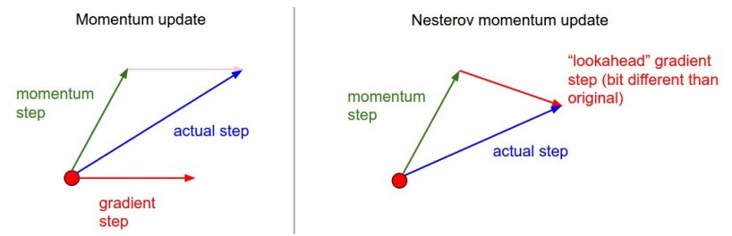
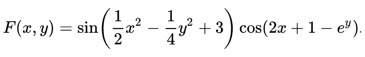
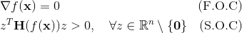
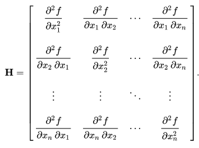
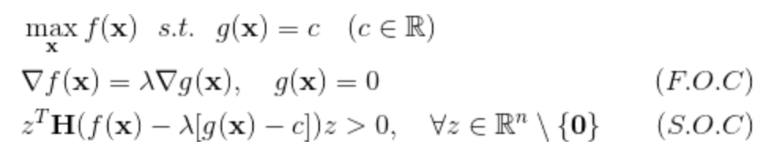
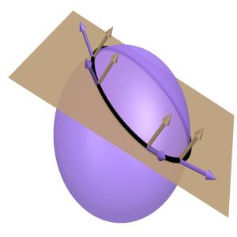
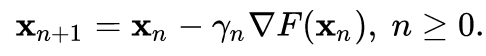
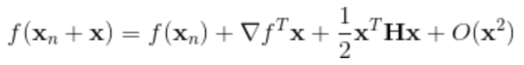
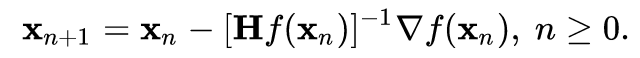
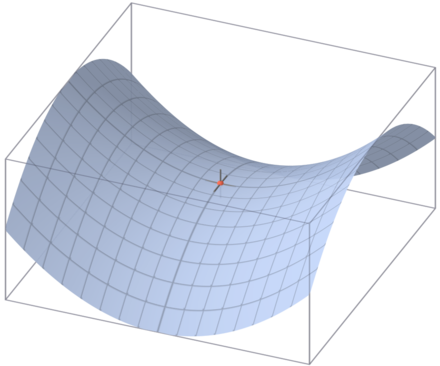

## Session 03
### 경사하강법

* 미분과 최적화
* 경사하강법
* 안장점 문제


1. 다음 설명을 읽고 <b>Nesterov Accelerated Gradient</b> 방법을 session03.py에 구현해봅시다.
> Momentum 방법에서는 gradient와 momentum step의 계산이 독립적으로 이루어집니다. 그러나 NAG에서는 momentum step을 고려하여, momentum step을 먼저 이동했다고 생각한 후 그 자리에서의 gradient를 구합니다.
<br></br>

<br></br>

2. 앞서 구현한 Nesterov Method를 이용해 다음 함수의 최소값을 찾아봅시다. 서로 다른 초깃값 3가지를 이용해서 결과를 비교해봅시다.
<br></br>

<br></br>


### 미분과 최적화

우리는 <b>미분</b>을 통해 주어진 지점에서의 기울기를 계산할 수 있습니다. 이는 미분가능한 함수에서 최대값과 최소값을 찾는데 매우 중요한 역할을 하는데요, (경계값을 제외하면) 기울기가 0인 지점에서 언제나 최대값과 최소값이 나타나기 때문입니다. 함수 f가 실수 x에 대해 두번 미분가능한 n차원 실가함수라고 할때, x가 최소값의 후보가 될 조건은 다음의 두가지입니다.
<br></br>

<br></br>
이때 H는 점 x에서 함수 f의 헤시안 행렬을 뜻합니다.
<br></br>

<br></br>
만약 f에 대해 우리가 탐색할 수 있는 x의 영역이 다른 함수 g에 의해 제한된다면, x가 최댓값의 후보가 될 조건은 x이 그 영역의 경계값 위에 있는지 여부에 따라 다음과 같이 나뉘게 됩니다.

첫째, 만일 f의 최소값이 제한된 영역 내부에 존재한다면, 이 최적화 문제는 앞서 이야기한 두가지 조건을 통해 후보를 탐색하는 문제와 동일한 해를 가집니다. 즉 g에 대한 제약식이 없다고 생각하고 오로지 f에 대해 최소값을 구하면 됩니다.

둘째, 만일 f의 최소값이 제한된 영역 외부에 존재한다면, 경우에 따라 외부의 경계값이 내부에 존재하는 모든 점보다 더 큰 값을 가질 수도 있습니다. 따라서 제약식이 다음과 같이 주어질때, 우리는 다음의 변형된 두가지 조건을 고려해야 합니다.
<br></br>

<br></br>
g에 의한 제약이 없을 때에는 f가 작아지는 방향으로 x를 증가시키다가, f가 커지기 직전에 멈추면 됩니다. 그러나 g에 의한 제약이 있을 때는 f의 함숫값이 g에 의한 경계값에 늘 접하도록 변화하여야 합니다. 다시 말해, 최소값의 후보가 되기 위해서는 해당 x에서 f의 미분값과 g의 미분값은 상수배를 이루어야만 합니다.

예를 들어 f가 원점으로부터의 거리, g가 3차원 평면이라고 하면 아래 그림에서 보라색 구가 갈색 평면에 접할 때 f는 최소값을 가지고, 이때 원점으로부터 접점을 이은 벡터와 평면의 법선벡터는 서로 평행임을 알 수 있습니다.
<br></br>

<br></br>
우리는 지금까지 다룬 내용을 통해 식만 제대로 주어진다면 언제든 최적화를 할 수 있습니다. 그러나 최적화를 해야하는 실제 상황에서 정작 우리는 그 목적함수의 형태를 모르는 경우가 많습니다. 우리는 데이터를 통해 f와 g가 혼합된 형태를 관측하게 되고, 추가적인 탐색을 통해 함수의 형태를 조금씩 추정해나가야만 합니다.

즉 단번에 앞선 두가지 조건을 만족하는 값 x\*를 찾는 것이 아니라, 언젠가 그 조건들을 만족하도록 정의역에서 수열 {x0, x1, x2, ...}을 만들어나가야 합니다. 이 경우 최적화 알고리즘은 현재 시점까지 관측값 {x0, x1, ..., xn}이 주어졌을 때 다음으로 탐색할 최적점 xn+1을 구하는 방법을 말합니다. 이번 차시에서는 이러한 최적화 알고리즘 중 머신러닝 분야에서 주로 이용하는 방법인 경사하강법을 소개하고자 합니다.


### 경사하강법

<b>경사하강법</b>이란 다음과 같이 최소값을 찾는 알고리즘을 말합니다.
<br></br>

<br></br>
xn이 주어졌을 때 xn에서의 미분값을 구해, 그 미분계수가 가리키는 방향의 반대쪽으로 아주 조금 이동한 점 xn+1을 탐색하는 것입니다. 이때 그 아주 조금의 정도를 결정하는 방식에 따라 경사하강법의 종류가 나뉘게 됩니다.

만일 F가 두번 미분가능하다면 우리는 F의 전체 형태를 모르더라도 점 xn을 중심으로 한 <b>테일러 전개</b>를 통해 F를 2차 다항식으로 근사할 수 있습니다.
<br></br>

<br></br>
F 대신 이 2차 다항식을 최소화하면 이동거리의 제곱에 비례하는 오차 범위 내에서 F의 최소값을 구할 수 있습니다. 만약 테일러 전개에서의 헤시안 행렬의 크기가 항상 특정 실수값 B보다 작다는 것을 알고 있으면, 경사하강법에서의 이동 크기를 1/B보다 작게 설정함으로써 원하는 최소값에 도달할 수 있다는 것이 알려져 있습니다. 따라서 대부분의 경우, 위 경사하강법 식에서의 감마를 지칭하는 <b>학습률</b>을 충분히 작은 숫자로 설정함으로써 우리는 미지의 함수 F에서의 최소값을 찾을 수 있습니다.

그러나 경사하강법은 F의 형태를 알 때 사용하는 2가지 조건을 통한 최적화 방법과 마찬가지로, 최종적으로 도달한 점 x\*가 함수 전체에서의 최소값인지 아니면 그저 x\* 근방에서의 극소값인지를 우리에게 구분하여 알려주지 않습니다. F의 형태를 아는 경우 조건을 만족하는 점의 개수를 알고 있기에 그러한 모든 점에서 함수값을 구해, 서로 비교해보면 됩니다. 하지만 경사하강법의 경우 알고리즘을 한번 시행할 때마다 하나의 점에만 도달할 수 있죠. n개의 서로 다른 극소값에 도달하기 위해서는 최소 n번 알고리즘을 사용해야 하고, 알고리즘의 초깃값 x0을 잘 설정해주지 않으면 경우에 따라 n번의 시행 모두 동일한 결과물을 얻게 될 수도 있습니다.

또 다른 문제는 학습률을 지나치게 작게 잡으면 최소값을 찾아가는 속도, 즉 학습 속도가 지나치게 느려진다는 점입니다. 한편 학습률을 지나치게 크게 잡으면 경사하강법이 올바르게 작동하기 위한 조건을 벗어나, 알고리즘이 수렴하지 못할 수도 있습니다. 우리는 헤시안의 상한 B를 모르기에 최적 학습률을 사전에 구할 수 없고, 데이터가 바뀔 때마다 적정 학습률을 시행착오를 통해 직접 정해주어야 합니다.

위 두가지 문제를 해결하기 위해 경사하강법에 다양한 변형과 응용이 이루어졌고, 이에 여러 분야에서 상황에 맞도록 각기 다른 알고리즘의 형태를 이용하고 있습니다. 첫번째 문제의 경우 주로 초깃값을 무작위로 설정해주는 방법과 하강하는 방향에 잡음을 넣어주는 방법 등이 많이 쓰이고 있습니다. 경사하강을 통해 확실히 극소값으로 도달한다는 것만 보장된다면 시도 횟수를 무수히 늘린 다음 가장 좋은 결과물을 선택하면 된다는 발상입니다. 따라서 보다 문제가 되는 것은 바로 두번째입니다. 학습 속도가 너무 느리면 시행 횟수를 늘리기 힘들고, 학습 자체가 안 된다면 우리는 경사하강법으로부터 좋은 결과를 얻을 수가 없기 때문입니다.

혹시 그렇다면 전체 헤시안의 상한은 알 수 없더라도, 관측값 xn 주변에서의 정보를 바탕으로 매번 헤시안 행렬을 추정해보면 어떨까하는 생각을 하고 계실지도 모르겠어요. 어차피 테일러 전개를 2차항까지만 이용하기로 했다면, 그 전개식을 다시 미분해서 F'= 0 이 되는 지점을 찾는 것이죠.
<br></br>

<br></br>
만약 그렇다면 당신은 <b>Newton-Rhapson method</b>를 바로 생각해내신 겁니다. Newton's method에서는 xn에서의 헤시안을 구해, 학습률이 매번 가장 자연스러운 크기와 방향을 가지도록 도와줍니다. 이 방법은 경사하강법에 필요한 여러가지 조건들이 만족될 때, 학습률을 상수로 둘 때보다 일반적으로 훨씬 빠르게 극소값으로 수렴하는 사실이 알려져 있습니다.

그런데 만일 저 헤시안 행렬이 최소값을 찾기 위한 2계조건(S.O.C)을 만족하지 않는다면 어떻게 될까요? Newton's method는 점 x\*가 1계조건만을 만족하면 2계조건과 무관하게 그 점의 방향으로 빠르게 이동하고자 하는 성질을 가지고 있습니다. 점 x\*가 2계조건을 만족하지 않는 경우 우리는 이 점을 안장점이라고 부릅니다. 즉 Newton's method는 기존의 방법보다 학습 속도는 훨씬 빠르지만, 안장점에 도달하면 더 이상 학습을 하지 못한다는 단점을 가지고 있습니다.


### 안장점 문제

<b>안장점</b>이라는 이름은 말의 안장을 닮은 그 형태로부터 비롯되었습니다. 안장점은 다변수 실함수에서, 특정 변수의 방향으로는 극소, 다른 변수의 방향으로는 극대값을 가지는 점을 말합니다. 안장점은 경사하강법의 입장에서는 빠르게 지나가야 하는 구간임에도 불구하고 미분값의 크기가 0이기에 종종 안장점에서 학습이 멈추어버리기도 합니다.
<br></br>

<br></br>
우리가 학습과정에서 안장점을 지날때 이 점이 안장점인지 아닌지를 알 수 있는 확실한 방법은 그 자리에서 헤시안 행렬을 계산해보는 것입니다. 그러나 헤시안 행렬을 계산하는 데는 차원의 제곱에 비례하는 O(n^2)만큼의 계산량이 필요하기에 이 방법은 학습속도를 빠르게 하자는 본래의 취지에 어긋납니다.

한편 현재 위치한 점이 극값인지 아닌지의 여부는 헤시안을 계산해보지 않고도 알 수 있습니다. 만약 우리가 지금 지나고 있는 점 xn이 최소값이고 앞으로 나아갈 점 xn+1가 이로부터 멀리 떨어진 점이라면, 우리는 xn+1에서 미분값을 계산함으로써 그 다음 점 xn+2는 다시 xn 근처로 돌아오게 될 것입니다. 이는 우리가 가운데가 움푹 파인 구덩이에서 공을 굴릴 때 공이 최저점을 여러번 지나치면서 점점 최저점에 가까워지는 모습과 유사합니다. 다른 점이 있다면 현재로선 경사하강의 속도가 미분값과 헤시안에만 의존할 뿐, 마찰력 등에 의해 시간에 따라 점점 느려지는 효과는 없다는 점입니다.

이러한 관성의 아이디어를 이용한 방법이 <b>Momentum</b> 방법입니다. 최소화하고자 하는 함수를 F라고 할 때 그 알고리즘은 다음과 같습니다.
```Python
# 함수 F(.)는 주어져 있다고 가정합니다.
# x는 n차원 벡터입니다. x.shape = (n,)
import numpy as np


class GradientDescent:
    def __init__(self, learning_rate=0.1):
        self.lr = learning_rate
        self.eps = 1e-3

    def train(self, F, x):
        # 만약 미분의 형태를 이미 알고 있는 경우 바로 미분계수를 넣으면 됩니다
        dim = x.shape[0]
        grad = np.zeros(x.shape)
        eps = np.zeros(x.shape)
        for i in range(dim):
            eps[i] = self.eps
            grad[i] = (F(x+eps) - F(x))/self.eps
            eps[i] = 0
        x = x - self.lr*grad
        return x


class Momentum(GradientDescent):
    def __init__(self, learning_rate=0.1, momentum=0.9):
        super(Momentum, self).__init__(learning_rate)
        self.momentum = momentum
        self.velocity = 0

    def train(self, F, x):
        dim = x.shape[0]
        grad = np.zeros(x.shape)
        eps = np.zeros(x.shape)
        for i in range(dim):
            eps[i] = self.eps
            grad[i] = (F(x+eps) - F(x))/self.eps
            eps[i] = 0
        self.velocity = self.momentum*self.velocity + self.lr*grad
        x = x - self.velocity
        return x
```
이때 Momentum 방법은 하강하는 구간이 길면 그만큼 가속도가 많이 붙기 때문에, 정작 감속해야 할 극값 주변에서도 이를 지나쳐버리고 다시는 돌아오지 못하는 상황이 발생하기도 합니다. 이에 <b>RMSProp</b> 방법은 그동안 많이 변화해온 변수에는 더 이상 가속도를 주지 않고, 지금까지 변화가 적었던 변수에 상대적으로 많은 가속도를 주고자 만들어진 방법입니다.
```Python
# 함수 F(.)는 주어져 있다고 가정합니다.
# x는 n차원 벡터입니다. x.shape = (n,)
import numpy as np


class RMSProp(GradientDescent):
    def __init__(self, learning_rate=0.1, momentum=0.9):
        super(RMSProp, self).__init__(learning_rate)
        self.momentum = momentum
        self.rms = 0

    def train(self, F, x):
        dim = x.shape[0]
        grad = np.zeros(x.shape)
        eps = np.zeros(x.shape)
        for i in range(dim):
            eps[i] = self.eps
            grad[i] = (F(x+eps) - F(x))/self.eps
            eps[i] = 0
        self.rms = self.momentum*self.rms + (1-self.momentum)*np.square(grad)
        x = x - self.lr*grad/np.sqrt(self.rms + self.eps)
        return x
```


### 참고자료

* 다크 프로그래머 :: 최적화 기법의 직관적 이해  
http://darkpgmr.tistory.com/149
* 테일러 급수 - 위키백과, 우리 모두의 백과사전  
https://ko.wikipedia.org/wiki/%ED%85%8C%EC%9D%BC%EB%9F%AC_%EA%B8%89%EC%88%98
* Newton's method - Wikipedia    
https://en.wikipedia.org/wiki/Newton%27s_method
* 안장점 - 위키백과, 우리 모두의 백과사전  
https://ko.wikipedia.org/wiki/%EC%95%88%EC%9E%A5%EC%A0%90
* Gradient Descent Optimization Algorithms 정리  
http://shuuki4.github.io/deep%20learning/2016/05/20/Gradient-Descent-Algorithm-Overview.html
* Exponential smoothing - Wikipedia  
https://en.wikipedia.org/wiki/Exponential_smoothing
