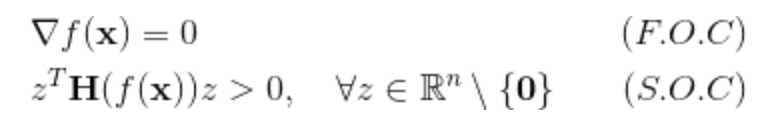

## Session 03 (작성중)
### 경사하강법

* 미분과 최적화
* 경사하강법의 종류
* 안장점 문제

1. GitHub에 본인 이름과 같은 이름의 폴더를 생성합니다.

### 미분과 최적화

우리는 미분을 통해 주어진 지점에서의 기울기를 계산할 수 있습니다. 이는 미분가능한 함수에서 최대값과 최소값을 찾는데 매우 중요한 역할을 하는데요, (경계값을 제외하면) 기울기가 0인 지점에서 언제나 최대값과 최소값이 나타나기 때문입니다. 함수 f가 n차원 실수 x에 대한 두번 미분가능한 n차원 실가함수라고 할때, x가 최댓값의 후보가 될 조건은 다음의 두가지입니다.
  

  
이때 H는 점 x에서 함수 f의 헤시안 행렬을 뜻합니다.
  

  

### 경사하강법의 종류

### 안장점 문제

### 참고자료

* 다크 프로그래머 :: 최적화 기법의 직관적 이해  
http://darkpgmr.tistory.com/149
* Newton's method - Wikipedia  
https://en.wikipedia.org/wiki/Newton%27s_method
