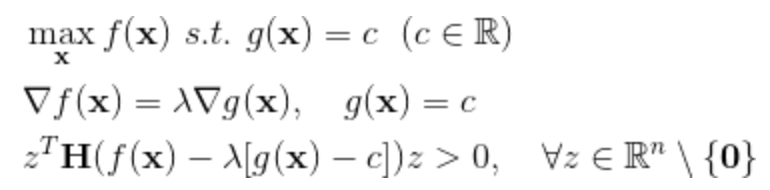

## Session 03 (작성중)
### 경사하강법

* 미분과 최적화
* 경사하강법의 종류
* 안장점 문제
* Numpy 패키

1. GitHub에 본인 이름과 같은 이름의 폴더를 생성합니다.

### 미분과 최적화

우리는 미분을 통해 주어진 지점에서의 기울기를 계산할 수 있습니다. 이는 미분가능한 함수에서 최대값과 최소값을 찾는데 매우 중요한 역할을 하는데요, (경계값을 제외하면) 기울기가 0인 지점에서 언제나 최대값과 최소값이 나타나기 때문입니다. 함수 f가 n차원 실수 x에 대한 두번 미분가능한 n차원 실가함수라고 할때, x가 최댓값의 후보가 될 조건은 다음의 두가지입니다.
  

  
이때 H는 점 x에서 함수 f의 헤시안 행렬을 뜻합니다.
  

  
만약 f에 대해 우리가 탐색할 수 있는 x의 영역이 다른 함수 g에 의해 제한된다면, x가 최댓값의 후보가 될 조건은 x이 그 영역의 경계값 위에 있는지 여부에 따라 다음과 같이 나뉘게 됩니다.

첫째, 만일 f의 최댓값이 제한된 영역 내부에 존재한다면, 이 최적화 문제는 앞서 이야기한 두가지 조건을 통해 후보를 탐색하는 문제와 동일한 해를 가집니다. 즉 g에 대한 제약식이 없다고 생각하고 오로지 f에 대해 최댓값을 구하면 됩니다.

둘째, 만일 f의 최댓값이 제한된 영역 외부에 존재한다면, 경우에 따라 외부의 경계값이 내부에 존재하는 모든 점보다 더 큰 값을 가질 수도 있습니다. 따라서 제약식이 다음과 같이 주어질때, 우리는 그 아래의 변형된 두가지 조건을 고려해야 합니다.
  

  
g에 의한 제약이 없을 때에는 f가 커지는 방향으로 x를 증가시키다, f가 작아지기 시작하기 직전에 멈추면 됩니다. 그러나 g에 의한 제약이 있을 때는 x에 따른 f의 함숫값이 g에 의한 경계값에 늘 접하도록 변화하여야 합니다. 다시 말해 최댓값의 후보가 되기 위해서는, 해당 x에서 f의 미분값과 g의 미분값은 상수배를 이루어야만 합니다. 예를 들어 f가 원점으로부터의 (유클리드)거리, g가 3차원 평면이라고 하면 아래 그림에서 보라색 구가 갈색 평면에 접할 때 f는 최솟값을 가지고, 이때 원점으로부터 접점을 이은 벡터와 평면의 법선벡터는 서로 평행임을 알 수 있습니다.
  

  

### 경사하강법의 종류

### 안장점 문제

### Numpy 패키지

### 참고자료

* 다크 프로그래머 :: 최적화 기법의 직관적 이해  
http://darkpgmr.tistory.com/149
* Newton's method - Wikipedia  
https://en.wikipedia.org/wiki/Newton%27s_method
