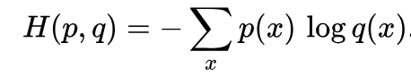
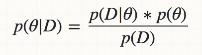
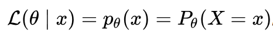

## Session 04
### 선형회귀

* 오차함수
* 선형회귀
* 정규화
* Scikit-learn 패키지

1. 작성중!  
    N(0,1)에서 무작위로 생성한 X, Y에 대해  
    Y = X1 + 2\*X2 + (X1+X3)\*X3 + X1*X4 + epsilon      
    이런 형태의 식으로 Y를 생성하고  
    Y의 식 형태를 맞춰보기  

### 오차함수

지난 3차시 동안 우리는 Python 기초문법, Numpy, Matplotlib과 같은 데이터 분석을 위한 각종 패키지, 그리고 경사하강법에 대한 내용을 다루며 마침내 데이터 분석을 위한 준비를 마쳤습니다! 이제부터는 현재 여러 학문 분야에서 이용하고 있는 데이터 분석 모형들에 대해 하나씩 알아보고자 해요.
  

  
여기서 먼저 데이터 분석 모형, 또는 <b>통계 모형</b>이란 주어진 관측값들의 집합 S에 대해 각각이 발생할 확률 P를 부여하는 관계를 말합니다. 이 관계는 주로 우리가 그 성질과 의미를 잘 알고 있는 정규분포, 선형회귀 모형 등의 실가함수군을 선택함으로써 형성할 수 있습니다. 이때 만약 그 관계를 관측값과 무관하게 선험적으로 정할 수 있다면 우리는 이미 그 관측값의 성질을 알고 있는 것과 마찬가지입니다.

따라서 모든 통계 모형은 관측 과정에서 조정할 수 있도록 <b>모수</b>라는 매개변수를 가지고 있습니다. 그리고 이러한 모수를 조정해주는 과정을 <b>통계적 학습</b>이라고 합니다. 통계적 학습은 데이터와 우리가 선택한 모형이 현재 얼마나 떨어져있는지를 <b>오차함수</b>를 통해 계산한 뒤 이를 줄이는 방향으로 모수를 변화시킴으로써 이루어집니다.

가장 대표적인 오차함수는 평균제곱오차가 속하는 <b>Lp 거리</b>(노름)입니다. 이때 p=1이면 절댓값, p=2면 평균제곱오차, p->infinity면 최댓값함수와 동일합니다.
  

  
한편 경우에 따라서는 각 관측값과 모형에서의 함수값 간의 거리를 하나씩 재서 이를 합하는 것보다, 관측값의 분포와 모형에서의 분포 간의 차이를 재는 편이 더 좋을 수도 있습니다. 다시 말해 점과 점 간의 거리가 아닌, 분포와 분포 간의 거리를 정의하고 이를 최소화함으로써 데이터와 모형의 간격을 좁히고자 하는 것입니다. 이러한 발상으로부터 만들어진 <b>교차 엔트로피 오차</b> 또한 자주 이용되고 있습니다.
  

  
마지막으로, 관측값들의 집합 S가 우리가 선택한 통계 모형으로부터 비롯되었다고 가정합시다. 이때 가능한 모수의 집합 A, B, C 중 A인 경우 S가 관측될 확률이 가장 높다고 할 때 우리는 A가 현재 관측된 데이터를 가장 잘 표현해주는 모수라고 생각할 수 있습니다.
  

  
바꿔 말하면 위와 같은 <b>베이즈 정리</b>에 의해 관측값이 S일 때 모수가 A일 확률은 반대로 모수가 A일 때 관측값이 S일 확률에 비례하기에, 우리는 다음과 같은 <b>가능도 함수</b>를 최대화하는 방법으로도 모형을 학습시킬 수 있습니다.
  

  

### 선형회귀

선형회귀란 X1, X2, X3, ... 등등의 변수를 통해 Y 변수를 예측하는 모형임  
(수식 & 평면모양 그림)  
선형회귀 모형의 모수는 X 옆에 달린 베타임  
이때 오차함수를 Lp 거리로 정의하면 epsilon을 최소화함으로써 학습 가능 (Least Squares)
한편 epsilon에 대한 확률분포를 가정하고, 이에 대한 가능도함수를 최대화함으로써도 학습 가능 (OLS)
이때 epsilon의 확률분포도 모수를 추가해 정의할 수 있다 (GLS)

### 정규화

이때 만일 설명변수의 개수가 무지무지 많아서 이중 가장 중요한 것만 쓰고 싶을 때,  
또는 모든 설명변수가 최대한 고르게 쓰였으면 좋겠을 때 등  
오차함수에 제약식을 추가하고 싶을 때가 있음  
이때는 저번에 언급한대로 라그랑지 승수법을 쓴다  
제약식에서의 상수항을 정하면 라그랑지 승수의 크기도 자연스럽게 정해진다 (람다)  
따라서 처음부터 그 람다값을 앞에 붙여줘도 똑같음잼  

L1 거리로 제약식 추가 -> 라소 회귀분석   
L2 거리로 제약식 추가 -> 릿지 회귀분석

### Scikit-learn 패키지

각종 머신러닝 툴들이 가득한 개꿀패키지  
회귀분석, 분류분석, 클러스터링, 모형선택 등을 위한 여러 메소드들이 있음  
우리는 이 중 경사하강법이랑 선형회귀 배웠으니까 linear_model.SGDRegressor를 사용할거임  
fit() 예시
predict() 예시  
get_params() 예시  
메소드마다 score() 함수가 있는데 linear_model에서는 R-squared라는 걸 사용함. R-squared 설명

### 참고자료

* Statistical model - Wikipedia  
https://en.wikipedia.org/wiki/Statistical_model
* 모수와 통계량의 관계 : 표본분포  
http://www.sigmapress.co.kr/shop/shop_image/g96862_1439883170.pdf
* 베이즈 정리 - 위키백과, 우리 모두의 백과사전  
https://ko.wikipedia.org/wiki/%EB%B2%A0%EC%9D%B4%EC%A6%88_%EC%A0%95%EB%A6%AC
* 가능도 - 위키백과, 우리 모두의 백과사전  
https://ko.wikipedia.org/wiki/%EA%B0%80%EB%8A%A5%EB%8F%84
* Mathpresso 머신 러닝 스터디 — 3. 오차를 다루는 방법_1 – Mathpresso – Medium  
https://medium.com/mathpresso/mathpresso-%EB%A8%B8%EC%8B%A0-%EB%9F%AC%EB%8B%9D-%EC%8A%A4%ED%84%B0%EB%94%94-3-%EC%98%A4%EC%B0%A8%EB%A5%BC-%EB%8B%A4%EB%A3%A8%EB%8A%94-%EB%B0%A9%EB%B2%95-7d1fb64ea0cf
* Mathpresso 머신 러닝 스터디 — 3.5 오차를 다루는 방법_2 – Mathpresso – Medium  
https://medium.com/mathpresso/mathpresso-%EB%A8%B8%EC%8B%A0-%EB%9F%AC%EB%8B%9D-%EC%8A%A4%ED%84%B0%EB%94%94-3-5-%EC%98%A4%EC%B0%A8%EB%A5%BC-%EB%8B%A4%EB%A3%A8%EB%8A%94-%EB%B0%A9%EB%B2%95-2-e23e08d95cc3
