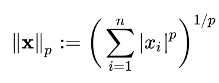

## Session 04
### 선형회귀

* 오차함수
* 선형회귀
* 정규화
* Scikit-learn 패키지


1. 다음과 같이 pickle 패키지를 통해 X, Y 데이터를 불러옵시다. X, Y 데이터는 session04.pkl 파일에 딕셔너리 형태로 들어가있습니다.
  ```Python
  import pickle

  path = '../../session04.pkl'     # session04.pkl이 있는 경로를 넣어주세요
  with open(path, 'rb') as f:
      data = pickle.load(f)
  X = data['X']
  Y = data['Y']
  ```
  scikit-learn의 SGDRegressor 클래스를 이용해 Y와 X의 관계를 밝혀내봅시다! session04.py에 각 X열이 가지는 회귀계수와 모형의 R-squared를 출력하는 코드를 적어주세요.


### 오차함수

지난 3차시 동안 우리는 Python 기초문법, Numpy, Matplotlib과 같은 데이터 분석을 위한 각종 패키지, 그리고 경사하강법에 대한 내용을 다루며 마침내 데이터 분석을 위한 준비를 마쳤습니다! 이제부터는 현재 여러 학문 분야에서 이용하고 있는 데이터 분석 모형들에 대해 하나씩 알아보고자 해요.
<br></br>

<br></br>
여기서 먼저 데이터 분석 모형, 또는 <b>통계 모형</b>이란 주어진 관측값들의 집합 S에 대해 각각이 발생할 확률 P를 부여하는 관계를 말합니다. 이 관계는 주로 우리가 그 성질과 의미를 잘 알고 있는 정규분포, 선형회귀 모형 등의 실가함수군을 선택함으로써 형성할 수 있습니다. 이때 만약 그 관계를 관측값과 무관하게 선험적으로 정할 수 있다면 우리는 이미 그 관측값의 성질을 알고 있는 것과 마찬가지입니다.

따라서 모든 통계 모형은 관측 과정에서 조정할 수 있도록 <b>모수</b>라는 매개변수를 가지고 있습니다. 그리고 이러한 모수를 조정해주는 과정을 <b>통계적 학습</b>이라고 합니다. 통계적 학습은 데이터와 우리가 선택한 모형이 현재 얼마나 떨어져있는지를 <b>오차함수</b>를 통해 계산한 뒤 이를 줄이는 방향으로 모수를 변화시킴으로써 이루어집니다.

가장 대표적인 오차함수는 평균제곱오차가 속하는 <b>Lp 거리</b>(노름)입니다. 이때 p=1이면 절댓값, p=2면 평균제곱오차, p->infinity면 최댓값함수와 동일합니다.
<br></br>

<br></br>
한편 경우에 따라서는 각 관측값과 모형에서의 함수값 간의 거리를 하나씩 재서 이를 합하는 것보다, 관측값의 분포와 모형에서의 분포 간의 차이를 재는 편이 더 좋을 수도 있습니다. 다시 말해 점과 점 간의 거리가 아닌, 분포와 분포 간의 거리를 정의하고 이를 최소화함으로써 데이터와 모형의 간격을 좁히고자 하는 것입니다. 이러한 발상으로부터 만들어진 <b>교차 엔트로피 오차</b> 또한 자주 이용되고 있습니다.
<br></br>

<br></br>
마지막으로, 관측값들의 집합 x가 우리가 선택한 통계 모형으로부터 비롯되었다고 가정합시다. 이때 가능한 모수의 집합 θ, η, δ  중 θ인 경우 x가 관측될 확률이 가장 높다고 할 때 우리는 θ가 현재 관측된 데이터를 가장 잘 표현해주는 모수라고 생각할 수 있습니다.
<br></br>

<br></br>
바꿔 말하면 위와 같은 <b>베이즈 정리</b>에 의해 관측값이 x일 때 모수가 θ일 확률은 반대로 모수가 θ일 때 관측값이 x일 확률에 비례하기에, 우리는 다음과 같은 <b>가능도 함수</b>를 최대화하는 방법으로도 모형을 학습시킬 수 있습니다.
<br></br>

<br></br>


### 선형회귀


<br></br>
선형회귀란 위 수식과 같이 변수들의 선형결합이 상수항을 이루는 모형을 말합니다. 이 모형의 모수는 각 변수 앞에 붙은 비례상수인 <b>회귀계수</b>들과 <b>오차항</b> epsilon의 형태입니다. 학습을 마치고 나면 각 비례상수의 부호와 크기를 통해 각 변수의 역할 및 중요도를 쉽게 해석할 수 있어 경제학과 같은 사회과학 분야에서 많이 이용되고 있는 모형입니다. 한편 선형회귀 모형은 변수간의 관계가 선형적이라고 가정하므로 만일 변수간 관계가 비선형적일 경우 모형의 적합이 제대로 이루어질 수 없습니다.

여기서 오차항이란 선형회귀 모형에서 제시한 선형결합과 실제 관측값이 얼마나 떨어져있는지를 나타내주는 변수입니다. 우리는 선형회귀 모형을 사용할 때 한 변수 Y가 다른 변수들 X와 어떤 관계를 맺고 있는지를 알아봄으로써, Y의 값을 각각의 특정한 X에 대해 예측해보고자 합니다. 따라서 주로 우리가 X를 통해 예측한 Y(Yhat)와 실제 관측한 Y 간의 차이를 계산하여 이를 오차항으로 나타냅니다.

오차함수를 만약 Lp 거리로 정의한다면 원점으로부터 오차항 epsilon의 Lp 거리를 최소화함으로써 이 선형회귀모형을 학습시킬 수 있습니다. 한편 오차함수를 오차항의 분포에 대한 가능도함수로 정의한다면 우리는 이 가능도함수를 최대화함으로써 학습시킬 수 있겠죠!
<br></br>

<br></br>
오차항의 분포로 가장 많이 이용되는 확률분포는 바로 <b>정규분포</b>입니다. 정규분포는 평균과 분산, 2가지 모수를 가지고 있는 확률분포로, 모수의 개수는 n차원 정규분포의 경우 총 평균이 n개, 분산이 nxn개로 n(n+1)개입니다. 이때 선형회귀 모형의 오차항의 경우 평균항이 전부 모형의 상수항 안에 포함되므로 분산 n^2개만을 정의해주면 오차함수인 가능도함수를 계산해낼 수 있어요.

오차항의 분포를 평균이 0, 분산이 1인 정규분포로 가정할 때 이 선형회귀모형을 Ordinary Least Squares라고 하고, 평균이 0이지만 분산이 변수별로 다양한 형태를 가진다고 할 때 이를 Generalized Least Squares라고 합니다.


### 정규화

이제 지난 3차시에 다룬 최적화 방법 또는 경사하강법을 통해 오차함수를 최적화하는 일만 남았습니다. 그런데 혹시 지난 차시에 제약식을 도입한 최적화도 분명 다루었는데 이 방법은 어떻게 적용해야할지 궁금해하시는 분이 계실지 모르겠어요.

통계 모형의 최적화 과정에 추가적인 제약을 넣는 방법을 바로 <b>정규화</b>라고 합니다. 모형의 모수들이 오차함수를 줄이는 것 뿐 아니라, 우리가 원하는 추가적인 조건을 만족하면서 학습하도록 유도하는 방법이에요. 선형회귀 모형에서 주로 활용하는 정규화 방법은 크게 2가지입니다.

첫째는 변수가 굉장히 많아서 이 중 일부만을 모형에 활용하고 싶은 경우입니다. 즉 회귀계수의 대부분을 0으로 고정해두고, 오차를 가장 크게 줄이는 소수의 회귀계수만을 변동시키고 싶을 때에요. 이 경우 오차함수의 최적화 식에 회귀계수의 절댓값의 합이 특정값 T를 넘지 않는다는 제약식을 걸어두면 됩니다.

둘째는 모든 변수를 고르게 활용하고 싶은 경우입니다. 반대로 모든 회귀계수가 최대한 0으로부터 멀어졌으면 하는 경우죠. 이 경우 최적화 식에 회귀계수의 제곱의 합이 마찬가지로 특정값을 넘지 않는다는 제약식을 걸어서 학습을 수행합니다.
<br></br>

<br></br>
그런데 2계도함수를 통한 최적화 과정에서 우리가 제약식 앞에 붙는 상수항을 정해주는 일과 T의 크기를 정하는 일은 사실 동치입니다. 다시 말해 T를 직접 정해주지 않고 제약식 앞의 비례상수를 정해주기만 하면 최적화과정에 제약식을 거는 효과를 얻을 수 있습니다. 따라서 앞서 언급한 두 가지 제약식을 다음과 같이 오차함수에 바로 추가하면 이 새로운 오차함수가 우리가 원하는 형태의 최적화를 가능하게 합니다.
<br></br>

<br></br>
이 중 lambda1만을 활용하고 lambda2가 0일때 이를 Lasso 회귀분석이라고 합니다. lambda2만을 활용할때는 Ridge, 둘 다 활용하는 경우를 Elastic Net 회귀분석이라고 합니다.


### Scikit-learn 패키지

Scikit-learn은 통계학 또는 머신러닝 분야에서 이용하는 수많은 통계 모형들을 python에서 쉽게 이용할 수 있도록 해주는 멋진 패키지입니다. 이 중 우리는 선형회귀모형을 이용하는 방법에 대해 간단히 다뤄보도록 해요. 다양한 종류의 선형회귀모형 클래스를 제공하므로 입맛에 맞는 모형을 하나 먼저 불러옵시다.
```Python
# Ordinary Least Squares
from sklearn.linear_model import LinearRegression
# Huber 오차함수를 이용하는 선형회귀모형
from sklearn.linear_model import HuberRegressor
# 경사하강법을 활용한 선형회귀모형
from sklearn.linear_model import SGDRegressor
```
편의상 X, Y 데이터는 이미 준비되었다고 생각하고 코드를 적어보도록 하겠습니다. 이때 Y 데이터는 학습을 통해 우리가 예측하고자 하는 종속변수, X 데이터는 이를 설명하고자 하는 설명변수/통제변수입니다. X, Y 데이터는 전부 Numpy array 객체입니다.
```Python
import numpy as np

# X, Y 데이터를 정규분포로부터 랜덤하게 생성해보았습니다.
X = np.random.randn(10,10)
Y = np.random.randn(10)

"""
SGDRegressor의 입력값

loss : 오차함수의 형태 (squared_loss, huber, epsilon_insensitive 등)
penalty : 제약식의 형태 (l2, l1, elasticnet)
max_iter : 경사하강법의 반복횟수
eta0 : 학습률의 초깃값
learning_rate : 학습률의 변화방법 (constant, invscaling 등)
verbose : 학습과정의 출력여부

"""
model = SGDRegressor(loss='squared_loss', penalty=None,
                     max_iter=1000, eta0=0.1, learning_rate='constant',
                     verbose=True)

model.fit(X,Y)              # 선형회귀모형을 학습시킵니다.
print(model.coef_)          # 회귀계수 출력. 순서는 X와 같습니다.
print(model.intercept_)     # 상수항 출력

print(model.score(X,Y))     # 모형의 R-squared값 출력
```
scikit-learn 패키지에서는 각 모형이 얼마나 잘 학습되었는지를 나타내주는 score() 함수를 제공하고 있습니다. 선형회귀모형에서는 R-squared를 그 척도로 주로 활용하곤 합니다.

R-squared란 Y변수가 자체적으로 가지고 있는 분산에 비해 모형의 오차가 얼마나 작은가를 나타내어주는 통계량입니다. 만약 Y변수가 관측오차 등 외생적 요인으로 인해 변동이 큰 변수라면 아무리 좋은 데이터 X를 활용하더라도 모형의 오차는 커질 수 밖에 없겠죠. 따라서 이 경우 오차함수의 절대적 크기보다는 R-squared 값을 통해 모형의 적합성을 판단하는 편이 더 정확하다고 볼 수 있습니다.
<br></br>

<br></br>


### 참고자료

* Statistical model - Wikipedia  
https://en.wikipedia.org/wiki/Statistical_model
* 모수와 통계량의 관계 : 표본분포  
http://www.sigmapress.co.kr/shop/shop_image/g96862_1439883170.pdf
* 베이즈 정리 - 위키백과, 우리 모두의 백과사전  
https://ko.wikipedia.org/wiki/%EB%B2%A0%EC%9D%B4%EC%A6%88_%EC%A0%95%EB%A6%AC
* 가능도 - 위키백과, 우리 모두의 백과사전  
https://ko.wikipedia.org/wiki/%EA%B0%80%EB%8A%A5%EB%8F%84
* Mathpresso 머신 러닝 스터디 — 3. 오차를 다루는 방법_1 – Mathpresso – Medium  
https://medium.com/mathpresso/mathpresso-%EB%A8%B8%EC%8B%A0-%EB%9F%AC%EB%8B%9D-%EC%8A%A4%ED%84%B0%EB%94%94-3-%EC%98%A4%EC%B0%A8%EB%A5%BC-%EB%8B%A4%EB%A3%A8%EB%8A%94-%EB%B0%A9%EB%B2%95-7d1fb64ea0cf
* Mathpresso 머신 러닝 스터디 — 3.5 오차를 다루는 방법_2 – Mathpresso – Medium  
https://medium.com/mathpresso/mathpresso-%EB%A8%B8%EC%8B%A0-%EB%9F%AC%EB%8B%9D-%EC%8A%A4%ED%84%B0%EB%94%94-3-5-%EC%98%A4%EC%B0%A8%EB%A5%BC-%EB%8B%A4%EB%A3%A8%EB%8A%94-%EB%B0%A9%EB%B2%95-2-e23e08d95cc3
* [ISL] 6장 -Lasso, Ridge, PCR이해하기 · Go's BLOG  
https://godongyoung.github.io/%EB%A8%B8%EC%8B%A0%EB%9F%AC%EB%8B%9D/2018/02/07/ISL-Linear-Model-Selection-and-Regularization_ch6.html
* Documentation scikit-learn: machine learning in Python — scikit-learn 0.19.1 documentation  
http://scikit-learn.org/stable/documentation.html
