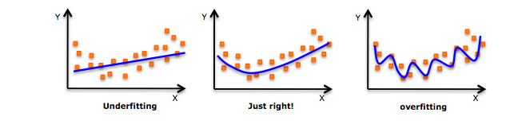

## Session 05
### 비선형회귀

* 가법모형
* Support Vector Machine
* 의사결정나무


1. 다음과 같이 pickle 패키지를 통해 X, Y 데이터를 불러옵시다. X, Y 데이터는 session05.pkl 파일에 딕셔너리 형태로 들어가있습니다.
    ```Python
    import pickle

    path = '../../session05.pkl'     # session05.pkl이 있는 경로를 넣어주세요
    with open(path, 'rb') as f:
        data = pickle.load(f)
    X = data['X']
    Y = data['Y']
    ```
    scikit-learn의 SGDClassifier 클래스를 이용해 Y와 X의 관계를 밝혀내봅시다! session05.py에 모형의 평균 정확도를 출력하는 코드를 적어주세요.


### 가법모형

이번 차시에서는 지난 차시에 배운 선형회귀모형을 확장해 보다 복잡한 형태의 모형을 만들어봅시다. E를 기댓값 연산자라고 할 때, 선형회귀모형의 수식은 다음과 같은 형태로도 나타낼 수 있습니다.
<br></br>

<br></br>
즉 선형회귀모형은 설명변수 X의 각 차원에 대해 선형연산을 해준 뒤, 이를 합함으로써 만들 수 있습니다. 이때 만약 X의 각 차원에 대해 선형연산 대신 비선형연산을 취해준다면 어떻게 될까요? 이러한 모형을 <b>가법모형</b>이라고 하고, X 뿐 아니라 종속변수 Y에도 비선형함수를 취해주는 경우 이를 <b>일반화 가법모형</b>이라고 합니다.
<br></br>

<br></br>
대표적인 가법모형으로는 <b>다항회귀모형</b>이 있습니다. 다항회귀란 마치 테일러 전개에서와 같이 X변수의 1차항 뿐 아니라 2차, 3차 등의 고차항을 선형회귀식의 변수로 이용하는 방법입니다.
<br></br>

<br></br>
2차원 평면에서 2개의 점을 잇기 위해서는 최소 1차인 함수가, 3개의 점을 잇기 위해서는 2차인 함수, 4개의 점을 잇기 위해서는 3차인 함수가 필요하듯 데이터의 분포가 고차원의 함수들로 이루어져있다면 우리는 선형회귀만으로 데이터의 분포를 올바르게 추정할 수 없습니다. 이러한 경우 선형회귀모형은 데이터에 <b>과소적합</b>되었다고 표현합니다. 이때 각 변수의 차수를 늘려 다항회귀모형으로 변환함으로써 이러한 문제를 해결할 수 있습니다.

한편 실제 데이터의 분포가 낮은 차수의 함수로 구성되어있을 때, 우리가 지나치게 높은 차수의 모형을 이용하게 되면 관측하지 못한 새로운 데이터에 대해 분산이 커지는 <b>과대적합</b> 또는 <b>과적합</b> 문제가 나타납니다. 따라서 모형의 차수는 항상 적정 수준을 유지해야 해요.
<br></br>

<br></br>
대표적인 일반화 가법모형으로는 <b>로지스틱 회귀모형</b>이 있습니다. 로지스틱 회귀모형은 X변수의 선형결합(선형회귀모형)에 로지스틱 함수를 취한 형태입니다.
<br></br>


<br></br>
로지스틱 함수는 치역이 (0,1)인 단조증가함수입니다. 따라서 주로 이진분류 문제에서 주어진 관측값 X가 특정 집합에 속하는지(=1) 아닌지(=0)의 여부를 판단할 때, 로지스틱 회귀모형을 통해 그 집합에 속할 확률을 나타내곤 합니다.

그럼 Scikit-Learn 패키지를 통해 앞선 두가지 모형을 한번 구현해봅시다! 저번 차시와 마찬가지로 경사하강법을 활용한 SGD 객체를 이용할 텐데요, 로지스틱 회귀는 주로 분류 문제에서 활용되므로 SGDRegressor가 아닌 SGDClassifier에서 이용하실 수 있습니다.
```Python
from sklearn.linear_model import SGDClassifier
import numpy as np

# X 데이터는 정규분포, Y 데이터는 베르누이분포로 추출하였습니다.
X = np.random.randn(10,10)
Y = np.random.binomial(1,0.5,10)

"""
SGDClassifier의 입력값

loss : 오차함수의 형태 (hinge, log, squared_loss 등)
penalty : 제약식의 형태 (l2, l1, elasticnet)
max_iter : 경사하강법의 반복횟수
eta0 : 학습률의 초깃값
learning_rate : 학습률의 변화방법 (constant, invscaling 등)
verbose : 학습과정의 출력여부

"""
# 오차함수를 'log'로 설정하면 로지스틱 회귀모형이 됩니다.
model = SGDClassifier(loss='log', penalty=None,
                     max_iter=1000, eta0=0.1, learning_rate='constant',
                     verbose=True)

model.fit(X,Y)                      # 로지스틱 모형을 학습시킵니다.
print(model.decision_function(X))   # 경계선까지의 거리 출력
print(model.coef_)                  # 회귀계수 출력
print(model.intercept_)             # 상수항 출력
print(model.score(X,Y))             # 모형의 평균 정확도 출력


# 다항회귀로 확장해보아요.
from sklearn.preprocessing import PolynomialFeatures

poly = PolynomialFeatures(2, include_bias=False)
X_poly = poly.fit_transform(X)      # 2차항과 교차항을 추가합니다.

model.fit(X_poly,Y)
print(model.decision_function(X_poly))
print(model.coef_)
print(model.intercept_)
print(model.score(X_poly,Y))
```
위 코드에서 model.fit()은 Y가 몇 가지 분류로 나뉠 수 있는지에 따라 다른 결과를 출력합니다. Y변수는 모두 정수여야 하고, 서로 다른 값을 2가지 이상 가져야 합니다. 이때 Y가 n가지 값(y0, y1, ..., yn)을 가진다면, model.fit은 가장 작은 값(y0)을 제외하고 n-1가지 값에 대해 각각 이진분류 모형을 생성합니다. 즉 n-1가지 분류에 각각 속하는지 아닌지를 판별하고, 모두 해당하지 않는 경우에만 첫번째 분류(y0)로 해당 관측값을 분류합니다. 만일 둘 이상의 분류에 속하는 경우, model.decision_function()을 통해 이진분류의 경계선으로부터 조금이라도 더 먼 쪽을 선택합니다.

Y가 n가지 분류를 가지는 경우, model.decision_function()은 각각의 관측값이 n-1개의 경계선까지 얼마나 떨어져있는지를 전부 출력해줍니다. 마찬가지로 model.coef_와 model.intercept_도 n-1가지 모형의 회귀계수와 상수항을 벡터값으로 전부 알려줍니다. 그러나 model.score()는 평균 정확도이므로 항상 1차원 스칼라값을 출력해줍니다.


### Support Vector Machine

<b>Support Vector Machine</b>(SVM) 또한 일반화 가법모형의 한 갈래입니다. SVM은 로지스틱 회귀와 같이 본래 이진분류를 위해 만들어진 모형입니다. SVM에서는 두 분류를 나누는 경계선이 각 분류에 해당하는 점들로부터 최대한 멀어지도록 목적함수를 설정합니다. 다시 말해, 각 관측값으로부터 경계선까지의 거리의 최솟값을 뜻하는 <b>margin</b>을 최대화하여 두 분류가 서로 가장 먼 곳에서 경계선을 형성합니다.
<br></br>

<br></br>
한편 분류문제가 아닌 연속형 변수에 대한 회귀문제의 경우 마진은 최소화해야겠지요! 따라서 이 경우 반대로 각 관측값으로부터 경계선까지의 거리의 최댓값이 최소화되도록 목적함수를 다시 정의한 <b>Support Vector Regression</b> 모형을 이용합니다.

우선 SVM의 수식부터 한번 적어볼게요. Y는 -1 또는 1을 가지는 이진변수입니다.
<br></br>

<br></br>
여기서 phi를 만약 선형연산으로 정의하고, phi에 대한 노름을 L2 거리로 정의하면 두번째 줄의 식은 정확히 위 이미지에서의 초록색 점과 빨간색 점 간의 거리를 최대화하는 식이 됩니다.

한편 SVR의 수식은 다음과 같아요.
<br></br>

<br></br>
모형의 수식을 통해 얻은 Y의 예측값과 실제 Y값 간의 차이가 전부 epsilon 이내에 위치할 때, SVM과 마찬가지로 예측값을 최대한 정 가운데로 위치시키고자 하는 수식입니다.

그러나 데이터상에서 두 가지 분류가 서로 뒤섞여있거나, 아웃라이어 등으로 인해 모든 데이터가 epsilon 구간 안에 위치하지 않을 수도 있겠죠! 이러한 경우 위 두 수식을 만족하는 해는 존재하지 않습니다. 따라서 실제 데이터 분석 작업에서는 위 수식에서의 제약식을 조금 완화하여 사용하곤 하는데요, 완화하지 않은 형태의 목적함수를 <b>Hard-margin</b>, 완화하여 제약식에서의 오차를 허용하는 목적함수를 <b>Soft-margin</b> 형태라고 합니다.

주어진 제약식을 만족하면 0, 만족하지 않으면 그 차분만큼 더해주는 형태의 오차함수인 <b>Hinge Loss</b>을 정규항으로 추가한 뒤 본래의 제약식을 제거하면 바로 쉽게 Soft-margin 형태의 SVM, SVR을 만들 수 있습니다.
<br></br>

<br></br>
코딩 예시를 살펴보기 전에, 혹시 왜 SVM 모형을 다항회귀, 로지스틱 회귀 등의 모형들과 분리해 따로 소개했는지 눈치채셨나요? 대부분의 가법 모형들은 그 목적함수가 데이터의 예측값과 실제 데이터 간의 오차함수로, 그리고 제약식은 모형의 모수에 대한 식으로 이루어져 있습니다. 그러나 SVM 모형은 이와 달리 목적함수가 모형의 모수에, 제약식이 오차함수로 이루어져있죠. 제약식을 정규항을 통해 완화하면 이 차이는 결국 없어지겠지만, 모형을 통해 본래 표현하고자 하는 주안점이 다르다는 점을 기억해주셨으면 해요.
```Python
# Scikit-learn에서는 SVR이 아닌 SVM을 Support Vector Classifier라고 지칭합니다.
from sklearn.svm import SVC, SVR
import numpy as np

# X 데이터는 정규분포, Y 데이터는 베르누이분포로 추출하였습니다.
X = np.random.randn(10,10)
Y = np.random.binomial(1,0.5,10)

"""
SVC의 입력값

C : 정규항의 비례상수
kernel : X변수에 대해 적용할 phi 함수의 형태 (linear, poly, rbf, sigmoid)
degree : kernel=poly인 경우 다항식의 차수
gamma : phi 함수의 모수 (kernel의 형태에 따라 다릅니다)
max_iter : libsvm 알고리즘의 반복횟수
verbose : 학습과정의 출력여부

"""
# 선형 SVM 모형입니다.
model = SVC(C=1.0, kernel='linear', max_iter=1000, verbose=True)

model.fit(X,Y)             
print(model.decision_function(X))
print(model.coef_)
print(model.intercept_)
print(model.score(X,Y))     # 모형의 평균 정확도를 출력합니다.

"""
SVR의 입력값

C : 정규항의 비례상수
epsilon : epsilon의 크기
kernel : X변수에 대해 적용할 phi 함수의 형태 (linear, poly, rbf, sigmoid)
degree : kernel=poly인 경우 다항식의 차수
gamma : phi 함수의 모수 (kernel의 형태에 따라 다릅니다)
max_iter : libsvm 알고리즘의 반복횟수
verbose : 학습과정의 출력여부

"""
# 다항식을 이용한 SVR 모형입니다.
model = SVR(C=1.0, epsilon=0.1, kernel='poly', degree=3, gamma=1,
            max_iter=1000, verbose=True)

model.fit(X,Y)             
# 분류모형이 아니므로 decision_function은 없습니다.
print(model.coef_)
print(model.intercept_)
print(model.score(X,Y))     # 모형의 R-squared값을 출력합니다.

```


### 의사결정나무


<br></br>
<b>의사결정나무</b> 모형에서는 주어진 관측값이 특정 조건을 만족하는지의 여부에 따라 순차적으로 다른 조건을 적용해나가며, 나무의 시작단(상위 노드)에서부터 끝단(하위 노드)까지 따라내려갑니다. 더 이상 추가적인 조건의 판단이 필요 없는 지점(말단 노드)에 다다르면 모형의 처리과정이 끝나고, 말단 노드에 기록되어 있는 값을 그대로 출력합니다.

즉, 우리가 Y값을 분류/예측하고자 할때 각 구간 내에서 Y값이 일정한 값을 가지도록 X값을 여러 구간으로 나누는 방법입니다. 일반화 가법모형의 형태로 표현하자면 다음과 같은 <b>단위 계단 함수</b>의 합과 합성으로 이루어진 모형이라 할 수 있습니다.
<br></br>

<br></br>
의사결정나무 모형에서는 보통 목적함수의 형태를 직접적으로 정해두지 않고, 모형이 가져야 할 모수의 개수, 함수 합성의 최대 길이 등 목적함수가 갖추어야 할 간접적인 특징들을 정의합니다. 이후 이러한 특징들을 만족하면서 오차함수를 줄여나갈 수 있는 알고리즘을 통해 나무를 첫단에서부터 순서대로 생성해나갑니다.
<br></br>

<br></br>
분류를 목적으로 의사결정나무를 이용하는 경우, 각 노드에 대해 위 수식으로 나타나는 <b>지니 불순도</b>를 낮추는 방향으로 나무를 생성할 수 있습니다. 여기서 p_i는 해당 노드에 속하는 관측값 중 i번째 분류에 속하는 값들의 비율을 뜻해요. 여기서 한 i에 대해 p_i=1이 되어야지만 지니 불순도가 0이 되므로, 말단 노드가 언제나 한 가지 분류값만을 가지도록 모형을 학습시킬 수 있습니다.
<br></br>

<br></br>
한편 <b>정보획득</b>을 최대화함으로써도 유사한 효과를 얻을 수 있습니다. 이때 엔트로피에 대한 식을 보시면 -plogp의 형태인데요, 하위 노드의 엔트로피를 최소화함으로써 정보획득을 최대화할 수 있습니다. 이때 -p^2 형태인 지니 불순도와 비교해보면 정보획득을 최대화하는 알고리즘에서는 p=0보다는 p=1 근처, 즉 p가 더 커지는 쪽을 선호하는 것을 알 수 있어요.
<br></br>

<br></br>
연속형 변수에 대한 회귀문제의 경우 주로 <b>분산 감소</b> 알고리즘을 이용합니다. 여기서 S_t와 S_f는 상위 노드 S를 계단 함수를 통해 둘로 나누었을 때의 두 하위 노드를 의미합니다. 즉 위 수식은 분기를 주기 전 상위 노드에서의 분산값이 분기를 준 이후 두 하위 노드에서 얼마나 줄었는지를 나타냅니다. 학습 과정에서 분산이 가장 많이 감소하는 지점에서 추가적인 조건을 적용해 분기를 주면 학습이 끝난 뒤 말단 노드에서의 분산은 굉장히 작아지겠죠!

이렇게 학습의 조건만 정의해주면 알아서 목적함수의 형태를 결정해주는 모형을 <b>비모수적 모형</b>이라고 합니다. 앞서 언급한 가법모형에서의 phi 함수 또한 이와 같은 비모수적 방법으로 학습시킬 수 있어요. 비모수 모형의 장점은 역시 수식의 형태를 직접 결정해주지 않아도 알고리즘이 데이터에 맞게 잘 조정해준다는 점입니다. 그러나 알고리즘에 따라 적합한 문제 상황이 다르므로 모형의 모수를 정의하듯 알고리즘을 잘 선택해주어야 합니다.
```Python
from sklearn.tree import DecisionTreeClassifier, DecisionTreeRegressor
import numpy as np

# X 데이터는 정규분포, Y 데이터는 베르누이분포로 추출하였습니다.
X = np.random.randn(10,10)
Y = np.random.binomial(1,0.5,10)

"""
DecisionTreeClassifier의 입력값

criterion : 학습의 기준이 되는 오차함수 (gini, entropy)
splitter : 하위 노드로의 분기 기준 (best, random)
max_depth : 나무의 최대 길이
max_leaf_nodes : 말단 노드의 최대 개수

"""
model = DecisionTreeClassifier(criterion='gini',
                               splitter='best',
                               max_depth=10,
                               max_leaf_nodes=100
                               )

model.fit(X,Y)
print(model.feature_importances_)   # 학습 과정에서 각 X변수의 중요도를 출력합니다.
print(model.score(X,Y))             # 모형의 평균 정확도를 출력합니다.

"""
DecisionTreeRegressor의 입력값

criterion : 학습의 기준이 되는 오차함수 (mse, friedman_mse, mae)
splitter : 하위 노드로의 분기 기준 (best, random)
max_depth : 나무의 최대 길이
max_leaf_nodes : 말단 노드의 최대 개수

"""
model = DecisionTreeRegressor(criterion='mse',
                               splitter='best',
                               max_depth=10,
                               max_leaf_nodes=100
                               )

model.fit(X,Y)
print(model.feature_importances_)
print(model.score(X,Y))             # 모형의 R-squared값을 출력합니다.
```
이때 model.feature_importances_는 각 X변수에 대해 분기점이 생길 때마다 오차함수가 얼마나 줄어들었는지를 계산한 뒤, 각 분기점에 도달할 확률을 곱해 가중평균한 값입니다. 즉 데이터가 해당 분기점에 많이 도달할 수록, 그리고 오차함수가 많이 감소할수록 해당 X변수의 중요도를 높게 평가합니다.


### 참고자료

* 일반화가법모델(Generalized Additive Models)이란? : 네이버 블로그  
https://m.blog.naver.com/PostView.nhn?blogId=je1206&logNo=220804476471&proxyReferer=https%3A%2F%2Fwww.google.co.kr%2F
* Generalized additive model - Wikipedia   
https://en.wikipedia.org/wiki/Generalized_additive_model
* Polynomial regression - Wikipedia  
https://en.wikipedia.org/wiki/Polynomial_regression
* 데이터 사이언스 스쿨 (다항회귀와 과최적화)  
https://datascienceschool.net/view-notebook/d790cda83cc44317a490a143c368d2de/
* [Basic] 과적합(Overfitting) 풀어서 보기 – hyperdot  
https://hyperdot.wordpress.com/2017/02/06/%EA%B3%BC%EC%A0%81%ED%95%A9overfitting/
* 로지스틱 회귀 · ratsgo's blog  
https://ratsgo.github.io/machine%20learning/2017/04/02/logistic/
* 1.5. Stochastic Gradient Descent — scikit-learn 0.19.1 documentation    
http://scikit-learn.org/stable/modules/sgd.html#sgd
* Jaejun Yoo's Playground: 초짜 대학원생의 입장에서 이해하는 Support Vector Machine (1)  
http://jaejunyoo.blogspot.com/2018/01/support-vector-machine-1.html
* 결정 트리 학습법 - 위키백과, 우리 모두의 백과사전  
https://ko.wikipedia.org/wiki/%EA%B2%B0%EC%A0%95_%ED%8A%B8%EB%A6%AC_%ED%95%99%EC%8A%B5%EB%B2%95
* 의사결정나무(Decision Tree) · ratsgo's blog  
https://ratsgo.github.io/machine%20learning/2017/03/26/tree/
* 탐욕 알고리즘 - 위키백과, 우리 모두의 백과사전  
https://ko.wikipedia.org/wiki/%ED%83%90%EC%9A%95_%EC%95%8C%EA%B3%A0%EB%A6%AC%EC%A6%98
* 모수 모델 vs. 비모수 모델  
https://brunch.co.kr/@seoungbumkim/7
