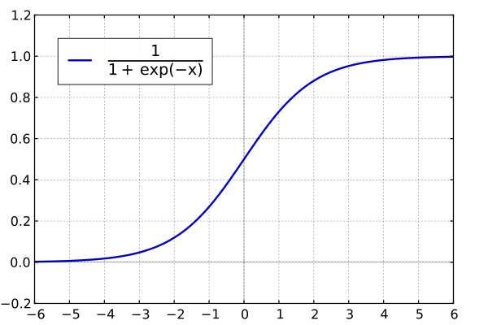

## Session 05
### 비선형회귀

* 가법모형
* Support Vector Machine
* 의사결정나무


1. sklearn Iris dataset 분류 문제
  ```Python
  ```


### 가법모형

이번 차시에서는 지난 차시에 배운 선형회귀모형을 확장해 보다 복잡한 형태의 모형을 만들어봅시다. E를 기댓값 연산자라고 할 때, 선형회귀모형의 수식은 다음과 같은 형태로도 나타낼 수 있습니다.
<br></br>

<br></br>
즉 선형회귀모형은 설명변수 X의 각 차원에 대해 선형연산을 해준 뒤, 이를 합함으로써 만들 수 있습니다. 이때 만약 X의 각 차원에 대해 선형연산 대신 비선형연산을 취해준다면 어떻게 될까요? 이러한 모형을 <b>가법모형</b>이라고 하고, X 뿐 아니라 종속변수 Y에도 비선형함수를 취해주는 경우 이를 <b>일반화 가법모형</b>이라고 합니다.
<br></br>

<br></br>
대표적인 가법모형으로는 <b>다항회귀모형</b>이 있겠네요. 다항회귀란 마치 테일러 전개에서와 같이 X변수의 1차항 뿐 아니라 2차, 3차 등의 고차항을 선형회귀식의 변수로 이용하는 방법입니다.
<br></br>

<br></br>
2차원 평면에서 2개의 점을 잇기 위해서는 최소 1차인 함수가, 3개의 점을 잇기 위해서는 2차인 함수, 4개의 점을 잇기 위해서는 3차인 함수가 필요하듯 데이터의 분포가 고차원의 함수들로 이루어져있다면 우리는 선형회귀만으로 데이터의 분포를 올바르게 추정할 수 없습니다. 이러한 경우 선형회귀모형은 데이터에 <b>과소적합</b>되었다고 표현합니다. 이때 각 변수의 차수를 늘려 다항회귀모형으로 변환함으로써 이러한 문제를 해결할 수 있습니다.

한편 실제 데이터의 분포가 낮은 차수의 함수로 구성되어있을 때, 우리가 지나치게 높은 차수의 모형을 이용하게 되면 관측하지 못한 새로운 데이터에 대해 분산이 커지는 <b>과대적합</b> 또는 <b>과적합</b> 문제가 나타납니다. 따라서 모형의 차수는 항상 적정 수준을 유지해야 해요.
<br></br>

<br></br>
대표적인 일반화 가법모형으로는 <b>로지스틱 회귀모형</b>이 있습니다. 로지스틱 회귀모형은 X변수의 선형결합(선형회귀모형)에 로지스틱 함수를 취한 형태입니다.
<br></br>



<br></br>
로지스틱 함수는 치역이 (0,1)인 단조증가함수입니다. 따라서 주로 이진분류 문제에서 주어진 관측값 X가 특정 집합에 속하는지(=1) 아닌지(=0)의 여부를 판단할 때, 로지스틱 회귀모형을 통해 그 집합에 속할 확률을 나타내곤 합니다.

그럼 Scikit-Learn 패키지를 통해 앞선 두가지 모형을 한번 구현해봅시다! 저번 차시와 마찬가지로 경사하강법을 활용한 SGD 객체를 이용할 텐데요, 로지스틱 회귀는 주로 분류 문제에서 활용되므로 SGDRegressor가 아닌 SGDClassifier에서 이용하실 수 있습니다.
```Python
from sklearn.linear_model import SGDClassifier
import numpy as np

# X 데이터는 정규분포, Y 데이터는 베르누이분포로 추출하였습니다.
X = np.random.randn(10,10)
Y = np.random.binomial(1,0.5,10)

"""
SGDClassifier의 입력값

loss : 오차함수의 형태 (hinge, log, squared_loss 등)
penalty : 제약식의 형태 (l2, l1, elasticnet)
max_iter : 경사하강법의 반복횟수
eta0 : 학습률의 초깃값
learning_rate : 학습률의 변화방법 (constant, invscaling 등)
verbose : 학습과정의 출력여부

"""
# 오차함수를 'log'로 설정하면 로지스틱 회귀모형이 됩니다.
model = SGDClassifier(loss='log', penalty=None,
                     max_iter=1000, eta0=0.1, learning_rate='constant',
                     verbose=True)

model.fit(X,Y)                      # 로지스틱 모형을 학습시킵니다.
print(model.decision_function(X))   # 경계선까지의 거리 출력
print(model.coef_)                  # 회귀계수 출력
print(model.intercept_)             # 상수항 출력
print(model.score(X,Y))             # 모형의 평균 정확도 출력


# 다항회귀로 확장해보아요.
from sklearn.preprocessing import PolynomialFeatures

poly = PolynomialFeatures(2, include_bias=False)
X_poly = poly.fit_transform(X)      # 2차항과 교차항을 추가합니다.

model.fit(X_poly,Y)
print(model.decision_function(X))
print(model.coef_)
print(model.intercept_)
print(model.score(X_poly,Y))
```
위 코드에서 model.fit()은 Y가 몇 가지 분류로 나뉠 수 있는지에 따라 다른 결과를 출력합니다. Y변수는 모두 정수여야 하고, 서로 다른 값을 2가지 이상 가져야 합니다. 이때 Y가 n가지 값(y0, y1, ..., yn)을 가진다면, model.fit은 가장 작은 값(y0)을 제외하고 n-1가지 값에 대해 각각 이진분류 모형을 생성합니다. 즉 n-1가지 분류에 각각 속하는지 아닌지를 판별하고, 모두 해당하지 않는 경우에만 첫번째 분류(y0)로 해당 관측값을 분류합니다. 만일 둘 이상의 분류에 속하는 경우, model.decision_function()을 통해 이진분류의 경계선으로부터 조금이라도 더 먼 쪽을 선택합니다.

Y가 n가지 분류를 가지는 경우, model.decision_function()은 각각의 관측값이 n-1개의 경계선까지 얼마나 떨어져있는지를 전부 출력해줍니다. 마찬가지로 model.coef_와 model.intercept_도 n-1가지 모형의 회귀계수와 상수항을 벡터값으로 전부 알려줍니다. 그러나 model.score()는 평균 정확도이므로 항상 1차원 스칼라값을 출력해줍니다.


### Support Vector Machine

서포트벡터머신 또한 일반화 가법모형의 한 갈래입니다.

======================= 여기까지 함  

서포트벡터머신은 원래 이진 분류 문제에서 비롯된 모형임  
데이터를 A와 B 그룹으로 각각 나눌 때 어떻게 하면 그 경계선이 A와 B의 딱 중간에 있도록 할 수 있을까에서 유래한 거 같아  
이때 경계선을 구하고 나면, 실상 각각 A, B로부터 그 경계선에 가장 가까운 점 2개만 빼고 나머지를 다 지운 다음  
경계선을 다시 구해보면 똑같은 게 나옴  
그래서 이 두 점이 경계선을 support 한다고 해서 support vectors라고 하고 support vectors를 찾은 다음  
그 경계선을 구하는 방법이 SVM임  

이진분류 문제를 확장해서 SVM 여러개로 one vs rest, one vs one 등으로 multiclass classification을 함  
또 한편으로는 데이터가 특정 경계선을 중심으로 epsilon 이상 떨어져있지 않다고 하면  
그 경계선에 최대한 내 함수를 맞추는 방식으로 regression이 가능  

그런데 대부분의 경우 A와 B가 딱 잘라서 나뉘어지는 경우가 없고 뒤섞여있자너  
그래서 epsilon에다가 추가로 zeta만큼의 오차까지 허용해주고, 이 zeta를 정규화식으로 넣어줌으로써 학습시킴  
zeta가 없는 앞선 방법론을 hard margin이라고 하고 이걸 soft margin이라고 함  

SVM이 가법모형과 다른 점은  
가법모형은 오차함수가 데이터의 상관관계로부터 얻는 오차 (MSE, Huber 등)이고 제약식은 모수에 걸리는 반면  
SVM은 오차함수가 모수의 크기 + zeta 정규식이고 제약식이 데이터의 오차야  

경계선이 선형이라고 가정할 때가 linear SVM  
여기에 가법모형과 같이 비선형함수 f(.)를 적용해서 적합하면 polynomial SVM, radial SVM 등등   


### 의사결정나무

의사결정나무는 정말 나무 같이 생겼음  
의사결정나무도 SVM과 마찬가지로 이진분류문제에서 비롯되었나봐  
맨 처음 노드(나무의 꼭대기)는 관찰한 데이터의 분포만으로  
우리가 새로운 관측값을 얻었을 때 이게 A인지 B인지를 찍어야하는 상황이야  
이 상황에서의 최선은 둘 중 더 많이 관측된 값으로 찍는 거겠징  

여기서 예컨대 X1값이 10보다 크면 A 아니면 B다와 같이 조건을 하나씩 추가하면서  
새로운 관측값에 대한 정확도를 조금씩 높여나감  
사전에 정한 조건의 개수, 또는 나무의 높이 등등의 기준을 만족하면 모형의 학습이 끝남  

이때 새로 추가할 조건의 내용과 나무 상에서의 위치를 정하는 기준(오차함수)은 크게 3가지가 있음  

첫째는 지니 불순도인데, 나무를 거쳐서 나온 예측값들이 서로 얼마나 뒤섞여있는지를 판단  
지니 불순도를 최소화하는 방향으로 학습함으로써 예측값의 정확도를 높일 수 있음  

둘째는 조건을 추가하기 전의 엔트로피와 조건을 추가한 이후의 엔트로피의 차이를 계산해서 이를 최대화   
즉 엔트로피를 낮추는 방향으로 학습시켜서 불확실성을 줄임  

셋째는 조건을 추가하기 전의 분산과 이후의 분산의 차이를 최대화  


### 참고자료

* 일반화가법모델(Generalized Additive Models)이란? : 네이버 블로그  
https://m.blog.naver.com/PostView.nhn?blogId=je1206&logNo=220804476471&proxyReferer=https%3A%2F%2Fwww.google.co.kr%2F
* Generalized additive model - Wikipedia   
https://en.wikipedia.org/wiki/Generalized_additive_model
* Polynomial regression - Wikipedia  
https://en.wikipedia.org/wiki/Polynomial_regression
* 데이터 사이언스 스쿨 (다항회귀와 과최적화)  
https://datascienceschool.net/view-notebook/d790cda83cc44317a490a143c368d2de/
* [Basic] 과적합(Overfitting) 풀어서 보기 – hyperdot  
https://hyperdot.wordpress.com/2017/02/06/%EA%B3%BC%EC%A0%81%ED%95%A9overfitting/
* 로지스틱 회귀 · ratsgo's blog  
https://ratsgo.github.io/machine%20learning/2017/04/02/logistic/
* 1.5. Stochastic Gradient Descent — scikit-learn 0.19.1 documentation    
http://scikit-learn.org/stable/modules/sgd.html#sgd
