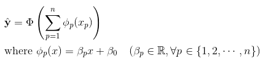

## Session 06
### 인공신경망


* 다층 퍼셉트론
* 합성곱 신경망
* 재귀 신경망
* Pytorch 패키지


1. 자기이름 폴더 아래 data 폴더를 만들고 MNIST 데이터 다운로드
2. .gitignore 파일 추가
3. Pytorch 패키지의 nn.Module을 이용해 간단한 인공신경망 만들어보기


### 다층 퍼셉트론

오늘은 딥러닝의 기초인 인공신경망 모형에 대해서 알아보도록 합시다!
<br></br>

<br></br>
<b>인공신경망</b> 모형은 두뇌에서의 뉴런 연결로부터 영감을 받은 모형으로, 여러 개의 퍼셉트론이 다층으로 연결된 형태입니다. <b>퍼셉트론</b>은 한 다발의 뉴런이 다음 다발의 뉴런으로 신호를 전달하는 모습을 다음과 같은 수식으로 단순화한 일반화 가법모형입니다.
<br></br>

<br></br>
즉 입력신호에 대해 선형변환을 한 후, 모종의 비선형 함수 Φ로 한번 더 변환해주는 것입니다. 이때 선형변환에서의 계수와 상수항은 퍼셉트론의 모수이고, Φ는 고정된 함수입니다. Φ는 <b>활성화 함수</b>라고 부르며 지난 차시에 다룬 로지스틱 함수와 단위 계단 함수 등이 활성화 함수로 주로 활용되곤 합니다.

한 퍼셉트론에서의 출력값을 다시 다음 퍼셉트론에서의 입력값으로 넣어주고, 이 퍼셉트론에서의 출력값을 다시 또 다음 퍼셉트론으로 연결해주는 형태의 모형을 <b>다층 퍼셉트론</b>이라고 합니다. 활성화 함수로 단위 계단 함수를 활용하는 다층 퍼셉트론은 지난 차시에 다룬 의사결정나무와 굉장히 유사합니다. 그러나 의사결정나무는 비모수적 방법으로 모형을 학습시키는 반면, 다층 퍼셉트론에서는 오차함수를 최소화하는 방향으로 모수들을 직접 학습시켜야 합니다. 따라서 의사결정나무의 경우 나무를 직접 키워보기 전까지는 모형이 어떤 형태가 될지 모르지만, 다층 퍼셉트론의 경우 모형의 형태가 학습과정에서 변하지 않습니다.
<br></br>

```Python
from sklearn.neural_network import MLPClassifier, MLPRegressor
import numpy as np

# X 데이터는 정규분포, Y 데이터는 베르누이분포로 추출하였습니다.
X = np.random.randn(10,10)
Y = np.random.binomial(1,0.5,10)

"""
MLPClassifier, MLPRegressor의 입력값

hidden_layer_sizes : 중간층의 뉴런 개수. 아래와 같이 튜플 형태로 입력해야 합니다.
                     e.g. (100,200,100)
                     이렇게 입력하면 중간층의 개수는 3개, 뉴런 개수는 순서대로 100, 200, 100입니다.                     
activation : 활성화 함수의 형태 (identity, logistic, tanh, relu)
solver : 경사하강법 알고리즘의 종류 (lbfgs, sgd, adam)
learning_rate : 학습률의 변화방법 (constant, invscaling 등)
learning_rate_init : 학습률의 초깃값
max_iter : 경사하강법의 반복횟수
verbose : 학습과정의 출력여부

"""
# 중간층의 개수가 하나, 중간층의 뉴런 개수가 100개인 다층 퍼셉트론입니다.
args = {'hidden_layer_sizes':(100,),
        'activation':'relu',
        'solver':'sgd',
        'verbose':True}

model = MLPClassifier(**args)
model.fit(X,Y)
print(model.score(X,Y))     # 모형의 평균 정확도를 출력합니다.

model = MLPRegressor(**args)
model.fit(X,Y)
print(model.score(X,Y))     # 모형의 R-squared값을 출력합니다.

```


### 합성곱 신경망


<br></br>
다층 퍼셉트론 모형으로 이미지 분류에 관한 문제를 학습시키면 위와 같은 흥미로운 사실을 발견할 수 있습니다. 각 중간층에서의 뉴런들이 어떤 값에 대해 활성화되는지를 그림으로 나타내보면, 입력층과 가까이 있는 뉴런들은 점, 선과 같은 저차원의 특징들을, 출력층에 가까이 있는 뉴런들은 얼굴, 다리, 날개 등과 같은 고차원의 특징들을 잡아내고 있다는 것을 알 수 있어요. 이때 각 특징은 그림 전체가 아닌 부분만을 참조하고 있고, 각 층 내에서 중복되는 경우가 많습니다.

이러한 사실에 착안하여 만들어진 모형이 합성곱 신경망입니다. <b>합성곱 신경망</b>에서는 각 뉴런이 이전 계층에서의 모든 출력값을 입력값으로 받지 않고, 자신의 근처에 있는 뉴런들로부터만 신호를 받습니다. 그리고 추출하는 특징이 중복되지 않도록 뉴런 간의 연결에 모종의 대칭구조를 부여합니다. 이렇게 하면 훨씬 적은 모수로 다층 퍼셉트론 모형과 동일한 분류 능력을 갖출 수 있겠죠!
<br></br>

<br></br>
입력값의 제한과 대칭구조는 다음과 같이 원래의 수식을 행렬곱이 아닌 합성곱으로 바꿈으로써 얻을 수 있습니다.
<br></br>

<br></br>
합성곱에서의 모수는 <b>필터</b> 또는 <b>커널</b>이라고 합니다. 이때 뉴런의 연결을 더욱 줄이기 위해 합성곱에서의 간격을 늘리기도 합니다. 합성곱은 보통 이미지가 가진 채널(RGB 등) 각각에 대해 따로 적용합니다.


### 재귀 신경망


### Pytorch 패키지


### 참고문헌

* 인공신경망 - 위키백과, 우리 모두의 백과사전  
https://ko.wikipedia.org/wiki/%EC%9D%B8%EA%B3%B5%EC%8B%A0%EA%B2%BD%EB%A7%9D
* Perceptron - Wikipedia  
https://en.wikipedia.org/wiki/Perceptron
* Multilayer perceptron - Wikipedia  
https://en.wikipedia.org/wiki/Multilayer_perceptron
* 딥러닝 원리의 이해_다층 퍼셉트론의 구조와 모델 : 네이버 블로그  
https://m.blog.naver.com/PostView.nhn?blogId=2011topcit&logNo=220510759079&proxyReferer=https%3A%2F%2Fwww.google.co.kr%2F
* [34편] 딥러닝의 기초 - 다층 퍼셉트론(Multi-Layer Perceptron; MLP) : 네이버 블로그  
http://blog.naver.com/PostView.nhn?blogId=samsjang&logNo=221030487369&parentCategoryNo=&categoryNo=80&viewDate=&isShowPopularPosts=true&from=search
* ReLu(Rectified Linear Unit)  
http://mongxmongx2.tistory.com/25
* Convolutional neural network - Wikipedia  
https://en.wikipedia.org/wiki/Convolutional_neural_network
* CS231n Convolutional Neural Networks for Visual Recognition  
http://aikorea.org/cs231n/convolutional-networks/
