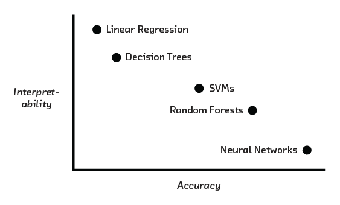
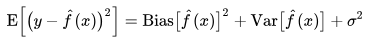
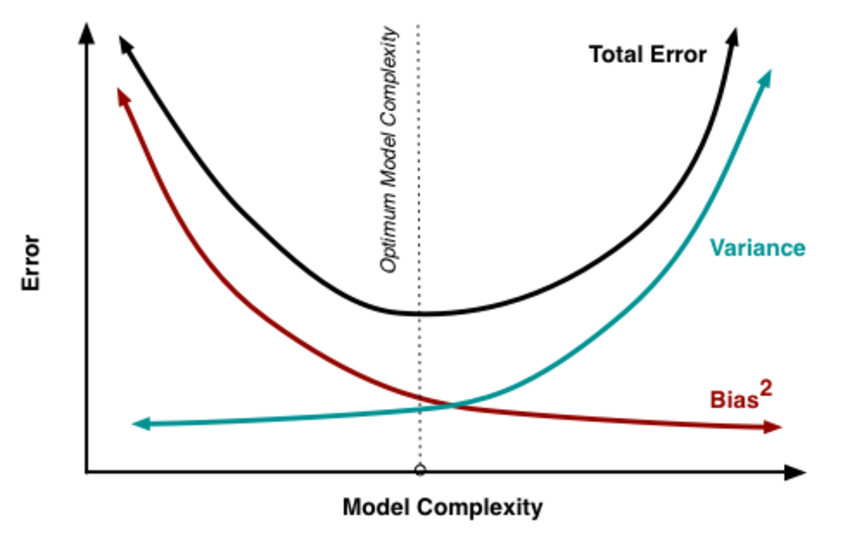
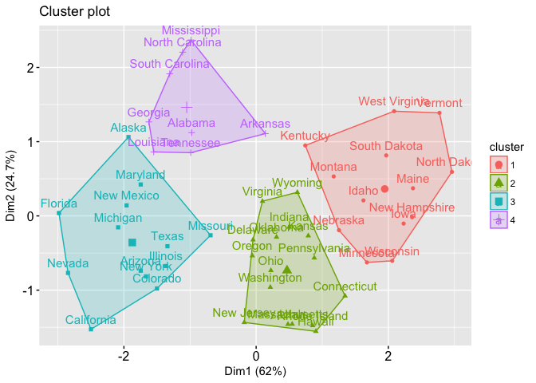
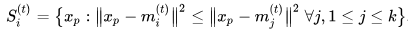
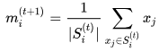

## Session 07
<<<<<<< HEAD
### 모형선택과 변수선택


* 교차검증
* 앙상블
* 군집분석


1. 지금까지 다룬 Scikit-learn 패키지의 객체들을 이용해 모형을 정의한 뒤, MNIST 데이터셋을 학습시켜봅시다.

```Python
import torch
from torchvision import datasets, transforms
from torch.utils.data import DataLoader
import numpy as np

# Options
DATA_PATH = './data'  # data 폴더의 위치를 넣어주세요.
BATCH_SIZE = 128      # 한 train step에서 불러오는 이미지의 개수입니다.
LOG_STEP = 100        # log_step마다 해당 step에서의 점수를 출력해줍니다.

def train(model, epochs):
    global DATA_PATH
    global BATCH_SIZE
    global LOG_STEP
    train_loader = DataLoader(
      datasets.MNIST(DATA_PATH, train=True, transform=transforms.ToTensor()),
      batch_size=BATCH_SIZE
    )
    for epoch in range(epochs):
      avg_score = 0
      for step, (images, labels) in enumerate(train_loader):
          images = images.numpy().reshape(images.size(0), -1)
          labels = labels.numpy()
          model.fit(images, labels)
          score = model.score(images, labels)
          avg_score += score
          if (step+1) % LOG_STEP == 0:
              print('Step : {}  Score : {}'.format(step+1, score))
      avg_score /= len(train_loader)
      print('Epoch : {}  Score : {}'.format(epoch+1, avg_score))

def test(model):
    global DATA_PATH
    global BATCH_SIZE
    test_loader = DataLoader(
      datasets.MNIST(DATA_PATH, train=False, transform=transforms.ToTensor()),
      batch_size=BATCH_SIZE
    )
    avg_score = 0
    for step, (images, labels) in enumerate(test_loader):
      images = images.numpy().reshape(images.size(0), -1)
      labels = labels.numpy()
      avg_score += model.score(images, labels)
    avg_score /= len(test_loader)
    print('Test Score : {}'.format(avg_score))


# 아래와 같이 모형을 정의한 뒤 학습시켜봅시다.
#
# model = SGDClassifier(...) 등 마음에 드는 모형으로 정의하기
#
# train(model, 100)     # training set을 100번 순환합니다.
# test(model)           # test set 전체에 대한 평균 점수 출력
# train(model, 10)
# test(model)
# ...
```

### 교차검증

지난 3차시 동안 우리는 OLS, SVM, 의사결정나무, 그리고 딥러닝 모형에 이르기까지 다양한 통계 모형들을 맛보았습니다. 물론 현재 학계와 실무에서 이용하고 있는 모형에는 잠재 디리클레 할당 모형, 베이즈 네트워크 등등 함께 살펴본 것 이외에도 정말 다양한 종류가 있어요. 그러나 이러한 복잡한 모형들도 그 세부구조는 전부 앞서 다룬 모형들과 크게 다르지 않습니다. 이제 여러분은 필요에 따라 다른 사람들이 어떤 모형을 활용하고 있는지를 알아보고 이를 금방 익혀서 구현하거나, 이미 알고 있는 모형들을 조합해서 새로운 모형을 만들어낼 수 있을 거에요.

이번 차시에서는 문제상황이 주어졌을 때 이렇게 다양한 모형들을 어떻게 활용할 것인지에 대해 생각해보도록 합시다.
<br></br>

<br></br>
우선 모형에 따라 모수의 개수가 다릅니다. 모수가 지니는 제약 조건도 다르죠! 모수의 개수가 지나치게 적거나 제약이 지나치게 강한 모형의 경우, 데이터의 복잡도를 모형이 전부 담아내지 못하는 과소적합 문제가 일어납니다. 반대로 모수의 개수가 지나치게 많거나 제약이 너무 느슨한 모형의 경우 모형이 실제 데이터보다 복잡한 과적합 문제가 일어나죠.

이러한 상황은 다음과 같은 오차의 <b>편향-분산 분해</b>식으로도 살펴볼 수 있습니다.
<br></br>

<br></br>
데이터의 평균과 예측치 간의 차이인 <b>편향</b>을 줄이기 위해서는 데이터의 형태를 잘 적합할 수 있도록 복잡한 모형이 필요합니다. 그러나 모형이 복잡해질수록 표본집단과 모집단 간의 분포 차이에 의해 평균값으로부터의 변동량을 뜻하는 <b>분산</b>이 커지게 됩니다.

따라서 단순한 모형에서는 주로 편향이 크되 분산이 작고, 복잡한 모형에서는 편향이 작되 분산이 큰 상황이 나타납니다. 그런데 단순한 모형에서는 모수에 줄 수 있는 변화가 적어 학습 방법을 변화시켜도 총 오차를 많이 줄이지 못하는 반면, 복잡한 모형에서는 모수 공간이 넓으므로 경우에 따라 편차도 줄이고, 분산도 줄일 수 있는 지점이 존재하기도 합니다. 예컨대 주어진 모수 개수의 절반만 활용한다든가, 경사하강법의 반복횟수를 줄인다든지 모형의 학습을 덜 시키면 되는 것이죠!
<br></br>

<br></br>

<br></br>
이러한 지점을 찾는 방법 중 하나가 바로 <b>교차검증</b>입니다. 교차검증은 우리가 관측한 데이터의 일부를 뗴어놓고 학습과정에서 제외한 뒤, 학습이 끝난 모형의 정확도를 이렇게 제외한 부분에 대해서만 평가하는 방법입니다. 데이터의 양이 충분히 많다면, 우리가 관측하지 못한 데이터의 분포가 학습과정에서 제외시킨 데이터의 분포가 유사하리라는 생각을 바탕으로 하고 있습니다.

따라서 만약 현재 풀어야 하는 문제에 있어 데이터에 대한 분류/예측의 정확도를 높이는 것이 가장 중요하다면, 시간과 자원이 허락하는 한 가장 복잡한 모형을 택한 뒤 교차검증을 통해 모형의 분산을 줄여나가면 됩니다.

그러나 만약 데이터에 대한 이해와 분석이 주된 목적이라면 비록 정확도가 낮더라도 단순한 형태의 모형을 이용하는 편이 좋을 수도 있습니다. 변수 간 어떠한 관계가 있는지, 변수의 한계적 변동은 얼마나 큰지 등 각 변수가 갖는 여러가지 성격을 살펴보기 위해서는 모형의 모수가 이계도함수의 유계, 연속성 등 다루기 좋은 성질들을 가지고 있어야 하기 때문이죠. 다시 말해 학습이 끝난 모형이 실제 데이터와 얼마나 가까운지보다는 우리가 살펴보고자 하는 성질들을 잘 드러내줄 수 있는 모형을 선택해야 합니다. 데이터의 분포에 대한 사전정보가 없다면 단순한 모형부터 시작하는 것도 좋겠죠?


### 앙상블


<br></br>
우선 정확도를 높이고자 하는 경우에 대해서 조금만 더 이야기해보아요. 우리가 함께 살펴본 모형 중 가장 복잡한 모형은 의사결정나무와 인공신경망이었습니다. 두 모형의 공통점은 단위계단함수, 퍼셉트론과 같은 간단한 함수를 반복적으로 적용했다는 점이에요. OLS, SVM 등의 단순한 모형도 이와 같은 방법을 통해 더욱 강력한 모형으로 만들 수 있습니다. 하나의 분류/예측 문제를 위해 다양한 모형을 학습시키고 합치는 방법을 <b>앙상블</b> 기법이라고 하고, 다음의 세 가지 유형이 대표적입니다.

<b>Bagging</b> 또는 <b>Bootstrap Aggregating</b> 방법은 관측된 데이터 안에서 여러 번 반복추출을 통해 인공적인 데이터셋을 여러 개 만들어낸 뒤, 각각의 데이터셋에 대해 모형을 하나씩 따로따로 학습시키는 방법입니다. 분류/예측 작업을 할 때에는 이렇게 학습시킨 모형들의 평균, 중앙값, 최빈값 등의 대표값을 이용합니다.

<b>Boosting</b> 방법에서는 우선 모형 하나를 선택해 학습시켜 분류/예측 작업을 수행해본 뒤, 실제 데이터와 예측값 간의 오차에 대해 다시 다른 모형을 학습시킵니다. 이후 그 오차에 대해서 또 다른 모형을 학습시키고, 다시 오차를 구하는 과정을 반복합니다. 이 과정은 마치 경사하강법을 모수공간이 아닌 각 모형을 기저로 하는 함수공간에서 반복하는 것과 같아요.

마지막으로 <b>Stacking</b> 방법은 관측된 데이터에 대해 여러가지 모형을 우선 학습시킨 다음, 이 모형들의 예측값을 원래의 데이터와 함께 입력값으로 사용하는 더 큰 모형을 학습시키는 방법입니다. 같은 데이터셋 내에서도 데이터의 유형에 따라 잘 작동하는 모형이 다르기에, 이 모형들을 모두 활용하면 더 좋은 성과를 얻을 수 있겠죠!

이 세 가지 유형을 단순하게 비교하자면, 우선 Bagging은 모형의 분산을 줄이고자 하는 반면 Boosting은 모형의 편향을 줄이고자 하는 방법입니다. 따라서 같은 모형들을 그 재료로 활용한다면 Boosting이 Bagging에 비해 더 정확도를 높일 수 있지만, 과적합의 위험도 더 큽니다.

또한 Bagging에서는 재료가 되는 모형들의 병렬 학습이 가능합니다. 한편 Boosting에서는 각 모형을 이전 단계에서의 잔차에 대해 학습시켜야 하기에 학습이 반드시 순차적으로 이루어져야 합니다.

Stacking은 사실상 Bagging과 Boosting을 모두 포함할 수 있는 방법입니다. 재료가 될 단순한 모형들을 Bagging을 통해 학습시킨 뒤, 이후에 출력값으로 연결할 모형들은 Boosting으로 학습시키는 등 두 가지 유형의 혼합이 가능하기 때문이에요. 따라서 Stacking 방법은 앞선 두 가지 유형의 장단점을 모두 가지고 있고, 우리가 이를 취사선택할 수 있습니다. 그러나 두 유형에 비해 엄청나게 많은 연산량을 필요로 한다는 점이 단점이에요.

Scikit-learn 패키지에서 제공하는 sklearn.ensemble 모듈을 통해 Stacking을 제외한 Bagging과 Boosting 방법을 한번 구현해봅시다.
```Python
from sklearn.ensemble import BaggingRegressor, AdaBoostRegressor
from sklearn.svm import SVR
from sklearn.datasets import load_boston
from sklearn.model_selection import train_test_split

# Scikit-learn에서 제공하는 Boston House Prices Dataset으로
# 1978년 Harrison, D.와 Rubinfeld, D.L.이 공개한 주택가격 데이터입니다.
X, Y = load_boston(True)

# 교차검증을 위해 데이터를 train 70%, test 30%로 나누었습니다.
X_train, X_test, Y_train, Y_test = train_test_split(X, Y, test_size=0.3)
base = SVR(C=1.0, epsilon=0.1, kernel='rbf', max_iter=1000)

"""
BaggingRegressor의 입력값

base_estimator : Bagging을 수행할 기본 모형
n_estimators : 모형의 개수
max_samples : 각 모형을 학습시키기 위해 최대 몇 개의 관측값을 이용할지
              즉 X값이 행렬일 때 X 중 몇 개의 열을 이용할지입니다.
              만약 0~1이면 총 관측값에 대한 비율로 계산해줍니다.
max_features : 각 모형을 학습시키기 위해 각 관측값에서 몇 개의 요소를 이용할지
               즉 X 중 몇 개의 행을 이용할지입니다.
               마찬가지로 0~1이면 비율로 계산해줍니다.
verbose : 학습과정의 출력여부

"""
bagging = BaggingRegressor(base_estimator=base,
                             n_estimators=100)
bagging.fit(X_train, Y_train)

"""
AdaBoostRegressor의 입력값

base_estimator : Bagging을 수행할 기본 모형
n_estimators : 모형의 개수
learning_rate : 매 단계에서 추가되는 모형 앞에 붙는 계수입니다.
                경사하강법에서의 학습률과 같은 의미입니다.
loss : 각 모형의 가중치를 계산하기 위한 오차함수 (linear, square, exponential)
verbose : 학습과정의 출력여부

"""
boosting = AdaBoostRegressor(base_estimator=base,
                             n_estimators=100)
boosting.fit(X_train, Y_train)

print(bagging.score(X_train, Y_train))
print(boosting.score(X_train, Y_train))

print(bagging.score(X_test, Y_test))
print(boosting.score(X_test, Y_test))

```


### 군집분석

우리에게 주어진 문제상황이 분류/예측에서의 높은 정확도를 얻는 것이 아니라, 데이터에 대한 이해도를 높이도록 요구할 수도 있습니다. 이 경우 앙상블 기법을 이용해 복잡한 모형을 만들기보다는, 우리가 이해하기 쉬운 단순한 모형을 이용해 데이터에 담겨있는 내용을 살펴보아야 하겠죠.
<br></br>

<br></br>
그런데 아무리 단순한 모형을 선택한다 하더라도 고려해야 하는 변수가 많으면 모형의 학습이 어려워지는 <b>차원의 저주</b>가 나타납니다. 선형회귀모형을 예로 들자면, 한 회귀계수가 가능도함수의 최소화 과정을 통해 올바르게 결정되려면 오차항의 분포가 다변량 정규분포에 수렴할만큼 관측값이 충분히 많이 주어져야 합니다. 따라서 만약 X값의 차원이 관측값의 수보다 크다면 우리는 우리가 구한 회귀계수에 편향이 있는지 없는지 장담할 수 없게 될 거에요.

이 경우 우리는 모형을 적합하기 위해 전체 변수가 아닌 변수의 부분집합을 선택해서 살펴보아야 합니다. 모든 부분집합을 한번씩 다 학습시켜서 결과를 전부 볼 수 있다면 좋겠지만 세상에는 데이터 작업 말고도 중요하고 재미난 일이 너무 많아요. 따라서 우리는 최소한의 변수를 통해 전체 데이터에 대한 최대한의 정보를 얻어내야 합니다.

<b>군집분석</b>은 유사한 관측값들을 각각 하나의 군집으로 묶음으로써 변수의 차원을 축소하는 방법입니다. 모수에 대한 오차함수를 정의하고 이를 최소화함으로써 통계 모형을 학습시키는 것과 같이, 군집분석 또한 오차함수를 최소화함으로써 각각의 관측값을 서로 연결하고자 합니다.
<br></br>

<br></br>
가장 대표적인 알고리즘은 <b>K평균</b> 알고리즘입니다. K평균 알고리즘은 각 군집 내에서의 분산을 최소화해 총 K개의 군집을 만드는 방법입니다. 따라서 K평균 알고리즘에서는 각 군집의 중심점(또는 대표값)이 정해지고 나면, 각 관측값은 자신과 가장 가까운 중심점이 위치한 군집 안에 포함되어야 합니다.

K평균 알고리즘에서는 이러한 필요조건을 만족한다는 전제로 각 군집 내에서의 분산을 최소화하고, 이렇게 구한 각 중심점에 대해 다시 필요조건을 만족하도록 관측값들을 각 군집에 배정하는 과정을 반복합니다.

즉 알고리즘의 t번째 단계에서 주어진 K개의 중심점 m1, m2, ..., mk에 대해 각 군집 S1, S2, ..., Sk는 다음 조건을 만족해야 합니다.
<br></br>

<br></br>
위 수식에서 구한 t번째에서의 군집에 대해 분산을 최소화하는 점을 t+1번째에서의 중심점으로 놓습니다.
<br></br>

<br></br>
이 과정을 반복해 K개의 중심점이 모두 수렴하고 나면, 우리는 데이터의 모든 변수를 고려하지 않고 이 K개의 중심점들이 형성하는 부분공간에 대해서만 모형을 학습시킬 수 있어요. 만일 K평균 알고리즘이 찾아낸 군집들이 우리가 보고자하는 특징들을 잘 잡아내었다면, 이 부분공간만 살펴보아도 충분한 정보를 얻어낼 수 있겠죠!
```Python
from sklearn.cluster import KMeans
from sklearn.datasets import load_iris

# Scikit-learn에서 제공하는 Iris Plants Database입니다.
# Iris-Setosa, Iris-Versicoliour, Iris-Virginica에 대한 데이터를 담고있어요.
X, Y = load_iris(True)
"""
KMeans의 입력값

n_clusters : 군집의 개수
init : 중심점의 초기값 설정
n_init : 초기값을 다르게 하여 시행할 총 횟수
max_iter : 한 가지 초기값당 알고리즘의 반복횟수
verbose : 학습과정의 출력여부

"""
kmeans = KMeans(n_clusters=3)
kmeans.fit(X)
print(kmeans.cluster_centers_)      # 각 군집의 중심점을 출력합니다.

accuracy = sum(kmeans.labels_ == Y) / len(Y)
print(accuracy)                     # 분류의 정확도를 출력합니다.

```


### 참고문헌

* 편향-분산 트레이드오프 - 위키백과, 우리 모두의 백과사전  
https://ko.wikipedia.org/wiki/%ED%8E%B8%ED%96%A5-%EB%B6%84%EC%82%B0_%ED%8A%B8%EB%A0%88%EC%9D%B4%EB%93%9C%EC%98%A4%ED%94%84
* Cross-validation (statistics) - Wikipedia  
https://en.wikipedia.org/wiki/Cross-validation_(statistics)
* [Artificial Intelligence / Posts] 교차검증 (Cross-validation)  
http://cinema4dr12.tistory.com/1275
* A toast to Occam’s razor; Accuracy vs Interpretability | John Poppelaars | Pulse | LinkedIn  
https://www.linkedin.com/pulse/toast-occams-razor-accuracy-vs-interpretability-john-poppelaars
* Ensemble learning - Wikipedia  
https://en.wikipedia.org/wiki/Ensemble_learning
* 08_CV_Ensembling  
http://www.cs.nthu.edu.tw/~shwu/courses/ml/labs/08_CV_Ensembling/08_CV_Ensembling.html
* Bagging과 Boosting 그리고 Stacking  
https://swalloow.github.io/bagging-boosting
* boosting 기법 이해 (bagging vs boosting)  
https://www.slideshare.net/freepsw/boosting-bagging-vs-boosting
* 에이다부스트 - 위키백과, 우리 모두의 백과사전  
https://ko.wikipedia.org/wiki/%EC%97%90%EC%9D%B4%EB%8B%A4%EB%B6%80%EC%8A%A4%ED%8A%B8
* 1.11. Ensemble methods — scikit-learn 0.19.1 documentation   
http://scikit-learn.org/stable/modules/ensemble.html#ensemble
* 빅데이터: 큰 용량의 역습 – 차원의 저주 (Curse of dimensionality) – 사이언스 라이프  
http://thesciencelife.com/archives/1001
* Curse of dimensionality - Wikipedia  
https://en.wikipedia.org/wiki/Curse_of_dimensionality
* 큰 수의 법칙 - 위키백과, 우리 모두의 백과사전  
https://ko.wikipedia.org/wiki/%ED%81%B0_%EC%88%98%EC%9D%98_%EB%B2%95%EC%B9%99
* Clustering 개요 · ratsgo's blog  
https://ratsgo.github.io/machine%20learning/2017/04/16/clustering/
* Cluster analysis - Wikipedia  
https://en.wikipedia.org/wiki/Cluster_analysis
* K-평균 알고리즘 - 위키백과, 우리 모두의 백과사전  
https://ko.wikipedia.org/wiki/K-%ED%8F%89%EA%B7%A0_%EC%95%8C%EA%B3%A0%EB%A6%AC%EC%A6%98
